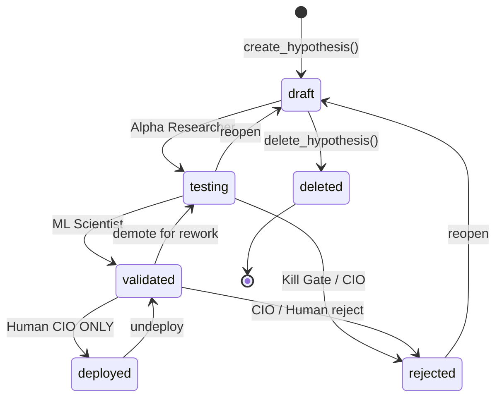

# HRP - Hedgefund Research Platform

## Project Overview

Personal quantitative research platform for systematic trading strategy development.
Long-only US equities, daily timeframe, institutional rigor.

- Universe: S&P 500 (excluding financials, REITs, penny stocks)
- Broker: Interactive Brokers
- Database: DuckDB at `~/hrp-data/hrp.duckdb`
- MLflow: `~/hrp-data/mlflow/`
- Logs: `~/hrp-data/logs/`

## Architecture

Three-layer architecture:
1. **Data Layer** - DuckDB storage, ingestion pipelines, feature store
2. **Research Layer** - VectorBT backtesting, MLflow experiments, hypothesis registry
3. **Control Layer** - Streamlit dashboard, MCP servers, scheduled agents

**The Rule:** External access goes through `hrp/api/platform.py`. Data layer modules (`hrp/data/`) may access `hrp/data/db.py` directly. Everything else uses the API.

## Key Principles

1. **Research-First** - Every strategy starts as a formal hypothesis
2. **Reproducibility** - All experiments versioned and re-runnable
3. **Statistical Rigor** - Walk-forward validation, significance testing enforced
4. **Audit Trail** - Full lineage from hypothesis to deployment

## Agent Permissions

| Action | Agent | User |
|--------|-------|------|
| Create/run hypotheses | Yes | Yes |
| Run backtests | Yes | Yes |
| Analyze results | Yes | Yes |
| **Deploy strategies** | **No** | Yes |

Agents cannot approve deployments or modify deployed strategies.

## Code Conventions

- Python 3.11+, type hints required
- Black formatting (100 char line length)
- Log all significant actions to lineage table

## API Quick Reference

All external access through `hrp/api/platform.py`:

```python
from hrp.api.platform import PlatformAPI
api = PlatformAPI()

# Core operations
api.run_backtest(config, hypothesis_id='HYP-2026-001')
api.create_hypothesis(title, thesis, prediction, falsification, actor='user')
api.get_prices(['AAPL'], start_date, end_date)
api.get_features(['AAPL'], ['momentum_20d'], date)
api.run_quality_checks(as_of_date, send_alerts=True)
api.link_experiment(hypothesis_id, experiment_id)  # Link MLflow run to hypothesis
api.update_hypothesis(hypothesis_id, status, outcome, actor)  # Guards: validated requires experiments

# ML operations
api.register_model(model, model_name, model_type, features, target, metrics, ...)
api.deploy_model(model_name, model_version, validation_data, environment, actor)
api.predict_model(model_name, symbols, as_of_date)
api.check_model_drift(model_name, current_data, reference_data, ...)

# Generic DB access (for ad-hoc queries outside data layer)
api.query_readonly(sql, params)       # Returns DataFrame (SELECT/WITH only)
api.fetchone_readonly(sql, params)    # Returns single row tuple
api.fetchall_readonly(sql, params)    # Returns list of tuples
api.execute_write(sql, params)        # INSERT/UPDATE/DELETE
```

## Available Features (45 implemented)

| Category | Features |
|----------|----------|
| **Returns** | `returns_1d`, `returns_5d`, `returns_20d`, `returns_60d`, `returns_252d` |
| **Momentum** | `momentum_20d`, `momentum_60d`, `momentum_252d` |
| **Volatility** | `volatility_20d`, `volatility_60d` |
| **Volume** | `volume_20d`, `volume_ratio`, `obv` |
| **Oscillators** | `rsi_14d`, `cci_20d`, `roc_10d`, `stoch_k_14d`, `stoch_d_14d`, `williams_r_14d`, `mfi_14d` |
| **Trend** | `atr_14d`, `adx_14d`, `macd_line`, `macd_signal`, `macd_histogram`, `trend` |
| **Moving Averages** | `sma_20d`, `sma_50d`, `sma_200d`, `ema_12d`, `ema_26d` |
| **EMA Signals** | `ema_crossover` |
| **Price Ratios** | `price_to_sma_20d`, `price_to_sma_50d`, `price_to_sma_200d` |
| **Bollinger Bands** | `bb_upper_20d`, `bb_lower_20d`, `bb_width_20d` |
| **VWAP** | `vwap_20d` |
| **Fundamental** | `market_cap`, `pe_ratio`, `pb_ratio`, `dividend_yield`, `ev_ebitda`, `shares_outstanding` |

## Hypothesis Lifecycle



**6 Statuses:** `draft` → `testing` → `validated` → `deployed` (plus `rejected`, `deleted`)

Pipeline progress tracked via lineage events, not status changes. See `docs/agents/decision-pipeline.md`.

## Agents

All agents follow `agent.run()` pattern. Agent pipeline chain:
**Signal Scientist → Alpha Researcher → ML Scientist → ML Quality Sentinel → Quant Developer → Kill Gate Enforcer → Validation Analyst → Risk Manager → CIO Agent → Human CIO**

| Agent | Purpose | Status Changes | Key module |
|-------|---------|----------------|------------|
| SignalScientist | Automated signal discovery (IC-based) | → `draft` | `hrp.agents` |
| AlphaResearcher | Reviews draft hypotheses, promotes to testing | `draft` → `testing` | `hrp.agents` |
| MLScientist | Walk-forward validation of testing hypotheses | `testing` → `validated` | `hrp.agents` |
| MLQualitySentinel | Audits experiments for overfitting | None (metadata only) | `hrp.agents` |
| QuantDeveloper | Production backtesting with costs | None (metadata only) | `hrp.agents` |
| KillGateEnforcer | Enforces kill gates on hypotheses | → `rejected` (hard kill) | `hrp.agents` |
| ValidationAnalyst | Pre-deployment stress testing | `validated` → `testing` (fail) | `hrp.agents` |
| RiskManager | Portfolio risk assessment, veto power | None (veto via lineage) | `hrp.agents` |
| CIOAgent | Scores hypotheses across 4 dimensions | → `rejected` (KILL) | `hrp.agents` |
| ReportGenerator | Daily/weekly research summaries | None | `hrp.agents` |

**Only Human CIO can set `deployed` status.**

## Key Modules

| Module | Purpose |
|--------|---------|
| `hrp.research.strategies` | `generate_multifactor_signals()`, `generate_ml_predicted_signals()` |
| `hrp.research.backtest` | `get_price_data()`, `run_backtest()` |
| `hrp.research.metrics` | `calculate_metrics()`, `calculate_stability_score_v1()` |
| `hrp.research.parameter_sweep` | `parallel_parameter_sweep()` with Sharpe decay analysis |
| `hrp.ml` | `WalkForwardConfig`, `walk_forward_validate()`, `cross_validated_optimize()` |
| `hrp.ml` | `HMMConfig`, `RegimeDetector` for regime detection |
| `hrp.risk` | `TestSetGuard`, `validate_strategy()`, `check_parameter_sensitivity()` |
| `hrp.risk.overfitting` | `SharpeDecayMonitor`, `HyperparameterTrialCounter`, `FeatureCountValidator`, `TargetLeakageValidator` |
| `hrp.research.config` | `BacktestConfig`, `StopLossConfig` (types: fixed_pct, atr_trailing, volatility_scaled) |
| `hrp.data.quality.validation` | `DataValidator` for price/feature/universe validation |
| `hrp.data.retention` | `RetentionEngine` (tiers: HOT 90d, WARM 1y, COLD 3y, ARCHIVE 5y+) |
| `hrp.data.lineage` | `FeatureLineage`, `DataProvenance` for audit trails |
| `hrp.data.ingestion` | Price, feature, universe, fundamentals ingestion jobs |
| `hrp.data.connection_pool` | `ConnectionPool` with retry/backoff for DuckDB |
| `hrp.ops` | `create_app()`, `run_server()` for health/metrics endpoints |
| `hrp.ops.thresholds` | `OpsThresholds`, `load_thresholds()` for configurable alerts |
| `hrp.ops.metrics` | `MetricsCollector` for system/data metrics |
| `hrp.utils.startup` | `validate_startup()`, `fail_fast_startup()` for production checks |
| `hrp.utils.locks` | `JobLock`, `acquire_job_lock()` for job concurrency |
| `hrp.utils.log_filter` | `filter_secrets()` to mask secrets in logs |
| `hrp.execution.broker` | `IBKRBroker`, `BrokerConfig` for IBKR connection |
| `hrp.execution.orders` | `Order`, `OrderManager`, `OrderType`, `OrderSide` |
| `hrp.execution.positions` | `Position`, `PositionTracker` for broker sync |
| `hrp.execution.signal_converter` | `SignalConverter`, `ConversionConfig` for order generation |
| `hrp.agents.prediction_job` | `DailyPredictionJob` for deployed model predictions |
| `hrp.agents.live_trader` | `LiveTradingAgent`, `TradingConfig` for trade execution |
| `hrp.agents.drift_monitor_job` | `DriftMonitorJob`, `DriftConfig` for model drift detection |

## Walk-Forward Validation

Supports purge/embargo periods to prevent temporal leakage:
- `purge_days`: gap between train and test (execution lag)
- `embargo_days`: initial test period excluded (implementation delay)
- `n_jobs=-1`: parallel fold processing (3-4x speedup)
- Stability Score v1: combines Sharpe CV, drawdown dispersion, sign flip penalty (lower is better, <= 1.0 is stable)

## Services

| Service | Command | Port |
|---------|---------|------|
| **Setup** | `./scripts/setup.sh` | - |
| **Setup (check only)** | `./scripts/setup.sh --check` | - |
| Dashboard | `streamlit run hrp/dashboard/app.py` | 8501 |
| MLflow UI | `mlflow ui --backend-store-uri sqlite:///~/hrp-data/mlflow/mlflow.db` | 5000 |
| Ops Server | `python -m hrp.ops` | 8080 |
| Single job | `python -m hrp.agents.run_job --job prices` | - |
| Scheduler | `python -m hrp.agents.run_scheduler` | - |
| Scheduler (full) | `python -m hrp.agents.run_scheduler --with-data-jobs --with-research-pipeline` | - |
| Start/stop services | `./scripts/startup.sh start\|stop\|status` | - |
| HRP CLI | `hrp --help` | - |

Job scheduling: Individual launchd plists in `launchd/`, managed via `scripts/manage_launchd.sh install|uninstall|status|reload`

## Environment Variables

> **See `.env.example` for the complete list of all ~50 configurable variables with defaults and descriptions.**

| Category | Key Variables | Required |
|----------|--------------|----------|
| **Core** | `HRP_ENVIRONMENT`, `HRP_DATA_DIR`, `HRP_DB_PATH`, `LOG_LEVEL` | No |
| **Data Sources** | `POLYGON_API_KEY`, `ALPACA_API_KEY`, `ALPACA_SECRET_KEY`, `TIINGO_API_KEY`, `SIMFIN_API_KEY` | No |
| **Claude API** | `ANTHROPIC_API_KEY` | For production |
| **Notifications** | `RESEND_API_KEY`, `NOTIFICATION_EMAIL`, `NOTIFICATION_FROM_EMAIL` | For alerts |
| **Auth** | `HRP_AUTH_ENABLED`, `HRP_AUTH_COOKIE_KEY`, `HRP_AUTH_USERS_FILE`, `HRP_AUTH_COOKIE_NAME`, `HRP_AUTH_COOKIE_EXPIRY_DAYS` | For auth |
| **Ops Server** | `HRP_OPS_HOST`, `HRP_OPS_PORT` | No |
| **IBKR** | `IBKR_HOST`, `IBKR_PORT`, `IBKR_CLIENT_ID`, `IBKR_ACCOUNT`, `IBKR_PAPER_TRADING` | For IBKR trading |
| **Broker** | `HRP_BROKER_TYPE` (`ibkr`, `robinhood`, `paper`) | For trading |
| **Robinhood** | `ROBINHOOD_USERNAME`, `ROBINHOOD_PASSWORD`, `ROBINHOOD_TOTP_SECRET`, `ROBINHOOD_ACCOUNT_NUMBER`, `ROBINHOOD_PAPER_TRADING` | For Robinhood |
| **Portfolio** | `HRP_PORTFOLIO_VALUE`, `HRP_MAX_POSITIONS`, `HRP_MAX_POSITION_PCT`, `HRP_MIN_ORDER_VALUE`, `HRP_TRADING_DRY_RUN` | No |
| **Risk & VaR** | `HRP_USE_VAR_SIZING`, `HRP_AUTO_STOP_LOSS_PCT`, `HRP_MAX_PORTFOLIO_VAR_PCT`, `HRP_MAX_POSITION_VAR_PCT` | No |
| **Real-Time** | `HRP_REALTIME_ENABLED`, `HRP_REALTIME_SYMBOLS`, `HRP_REALTIME_FLUSH_INTERVAL`, `HRP_REALTIME_MAX_BUFFER_SIZE`, `HRP_REALTIME_RECONNECT_MAX_DELAY` | No |
| **Thresholds** | `HRP_THRESHOLD_*` (11 overrides, see `docs/operations/alert-thresholds.md`) | No |

## Project Structure

```
hrp/
├── api/            # Platform API (single entry point)
├── data/           # Data layer (DuckDB, ingestion, features)
├── research/       # Research engine (backtest, hypothesis, lineage, strategies)
├── ml/             # ML framework (training, validation, signals)
├── risk/           # Risk management (limits, validation)
├── dashboard/      # Streamlit dashboard
├── mcp/            # Claude MCP servers
├── agents/         # Scheduled agents
├── notifications/  # Email alerts
├── ops/            # Ops server (health, metrics, thresholds)
├── execution/      # Live trading, broker integration (Tier 4)
├── monitoring/     # System health, ops alerting
└── utils/          # Shared utilities (startup, locks, log_filter)
```

## Where Does New Code Go?

| Adding... | Put it in... |
|-----------|--------------|
| New data provider | `hrp/data/sources/` |
| New ingestion pipeline | `hrp/data/ingestion/` |
| New computed feature | `hrp/data/features/definitions.py` + `computation.py` |
| New strategy/signal type | `hrp/research/strategies/` |
| New ML model type | `hrp/ml/` |
| New risk check | `hrp/risk/` |
| New dashboard page | `hrp/dashboard/pages/` |
| New scheduled job | `hrp/agents/jobs.py` |
| Expose via API | `hrp/api/platform.py` |

## Documentation

| Document | Purpose |
|----------|---------|
| `scripts/setup.sh` | Interactive onboarding: venv, deps, .env, DB, config fixes, auth, data bootstrap |
| `scripts/startup.sh` | Service management: start/stop/restart dashboard, MLflow, scheduler |
| `scripts/manage_launchd.sh` | launchd job management: install/uninstall/status/reload |
| `docs/architecture/data-pipeline-diagram.md` | Data pipeline: sources → jobs → DuckDB → agents → outputs |
| `docs/agents/decision-pipeline.md` | Agent decision workflow: 10 stages, kill gates, scoring, human approval |
| `docs/agents/state-machine-transitions.md` | Complete state machine documentation: hypothesis states, pipeline stages, events, thresholds |
| `docs/agents/01-*.md` through `docs/agents/10-*.md` | Individual agent specifications (numbered by pipeline order) |
| `docs/plans/Project-Status.md` | Development roadmap and tier status |
| `docs/setup/Scheduler-Configuration-Guide.md` | launchd job configuration |

## Testing

```bash
pytest tests/ -v
```

## Development Status

| Tier | Focus | Status |
|------|-------|--------|
| **Foundation** | Data + Research Core | 100% |
| **Intelligence** | ML + Agents | 100% |
| **Production** | Security + Ops | 100% |
| **Trading** | Live Execution | 0% |

See `docs/plans/Project-Status.md` for details.

# Development Guidelines

1. **Think Before Coding** - State assumptions explicitly. If uncertain, ask. If multiple interpretations exist, present them. Push back when warranted.

2. **Simplicity First** - Minimum code that solves the problem. No features beyond what was asked. No abstractions for single-use code. If 200 lines could be 50, rewrite it.

3. **Surgical Changes** - Touch only what you must. Don't improve adjacent code. Match existing style. Remove only orphans YOUR changes created.

4. **Goal-Driven Execution** - Transform tasks into verifiable goals. State a brief plan with verification steps. Loop until verified.
