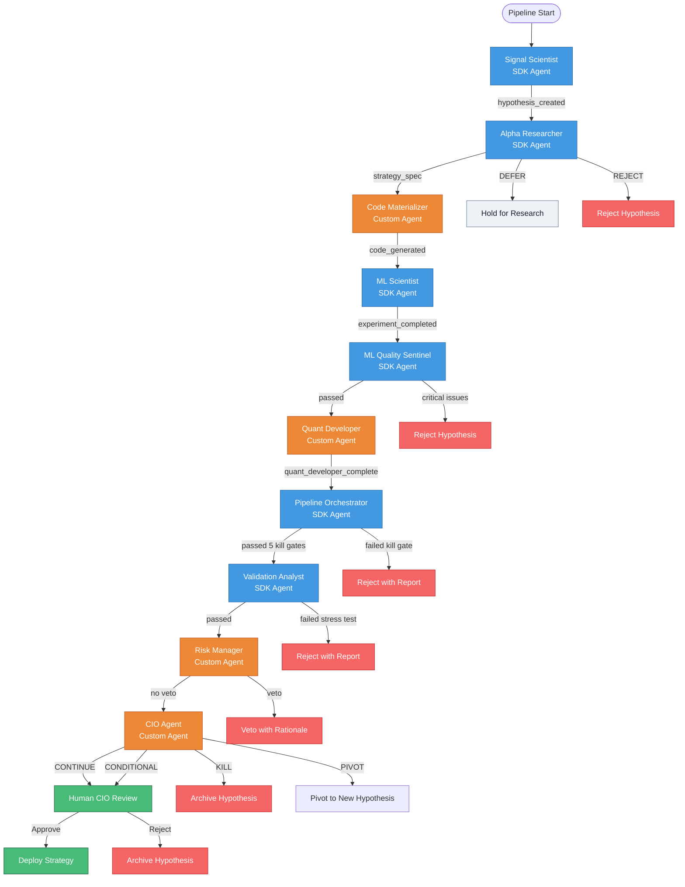
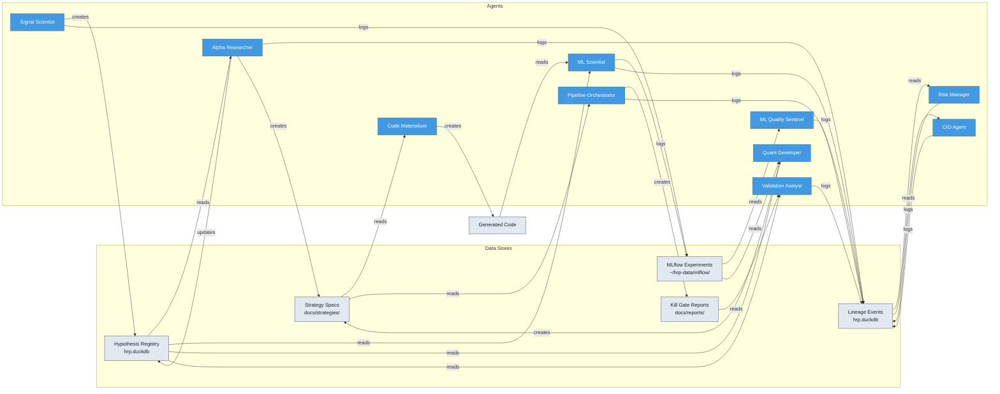
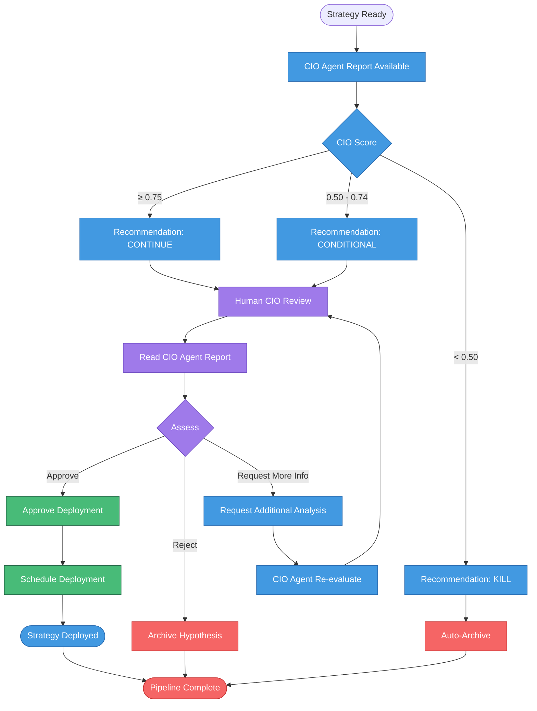

# HRP Research Agents - Interaction Diagram

## Overview

The HRP (Hedge Fund Research Platform) uses a sophisticated 11-agent research pipeline that automates the end-to-end strategy development process, from signal discovery to human CIO approval. The pipeline is event-driven, using lineage events to trigger downstream agents automatically.

### Key Features

- **Event-Driven Architecture**: Agents communicate through lineage events in the database
- **Multiple Kill Gates**: Quality checks at 5 critical points prevent bad strategies from advancing
- **Human-in-the-Loop**: Final approval always requires human CIO decision
- **Automated Handoffs**: Once initiated, the pipeline runs autonomously until human approval
- **Audit Trail**: Every action is logged to the lineage table for full reproducibility

---

## Complete Agent Pipeline

---

## Event-Driven Trigger Matrix

| Source Agent | Lineage Event | Target Agent | Trigger Condition |
|--------------|---------------|--------------|-------------------|
| Signal Scientist | `hypothesis_created` | Alpha Researcher | New hypothesis in 'draft' status |
| Alpha Researcher | `alpha_researcher_complete` | Code Materializer | Strategy spec ready for materialization |
| Code Materializer | `code_materializer_complete` | ML Scientist | Code generated, syntax valid |
| ML Scientist | `experiment_completed` | ML Quality Sentinel | Walk-forward validation finished |
| ML Scientist | `experiment_completed` | ML Quality Sentinel | Walk-forward validation finished |
| ML Quality Sentinel | `ml_quality_sentinel_audit` | Quant Developer | Overall quality check passed |
| Quant Developer | `quant_developer_backtest_complete` | Pipeline Orchestrator | Strategy spec and backtest ready |
| Pipeline Orchestrator | `pipeline_orchestrator_complete` | Validation Analyst | All 5 kill gates passed |
| Validation Analyst | `validation_analyst_complete` | Risk Manager | Stress testing passed |
| Risk Manager | `risk_manager_assessment` | CIO Agent | No veto issued |
| CIO Agent | `cio_agent_decision` | Human CIO | Decision (CONTINUE/CONDITIONAL) ready |

---

## Agent Responsibility Matrix

| Agent | Type | Creates | Consumes | Outputs |
|-------|------|---------|----------|---------|
| **Signal Scientist** | SDK | Hypotheses (draft) | Features, prices | MLflow runs with IC scores |
| **Alpha Researcher** | SDK | Economic rationale, strategy specs | Draft hypotheses | Research notes, strategy specs (NO CODE) |
| **Code Materializer** | Custom | Executable code | Strategy specs | Generated strategy code |
| **ML Scientist** | SDK | Experiments | Testing hypotheses | Walk-forward validation results |
| **ML Quality Sentinel** | SDK | Audit reports | Completed experiments | Quality flags (passed/failed) |
| **Quant Developer** | Custom | Strategy specs | Audited experiments | Strategy YAML, code templates |
| **Pipeline Orchestrator** | SDK | Deployment packages | Strategy specs | Kill gate reports (5 types) |
| **Validation Analyst** | SDK | Stress test reports | Validated strategies | Pre-deployment validation |
| **Risk Manager** | Custom | Risk assessments | Stress-tested strategies | Veto or approval |
| **CIO Agent** | Custom | CIO decisions | Risk-approved strategies | 4-way decision scores |
| **Human CIO** | Human | Deployment approvals | CIO agent recommendations | Final deploy decision |

---

## Data Flow Diagram

---

## Decision Gates

### 1. Alpha Researcher Gate
**Location:** After Signal Scientist → Before ML Scientist

**Decision Types:**
- **PROCEED**: Hypothesis has strong economic rationale, promote to testing
- **DEFER**: Needs more research, hold in draft
- **REJECT**: Fundamentally flawed, archive hypothesis

**Criteria:**
- Economic plausibility (why signal might work)
- Regime context (performance in different market conditions)
- Novelty assessment (not duplicating existing strategies)
- Refined falsification criteria

### 2. ML Quality Sentinel Gate
**Location:** After ML Scientist → Before Quant Developer

**Decision Types:**
- **Passed**: All quality checks within thresholds
- **Failed**: Critical issues detected, stop pipeline

**Quality Checks:**
- Sharpe decay (train vs test): < 50%
- Target leakage: correlation < 0.95
- Feature count: < 50 features
- Fold stability: CV < 2.0
- Suspicious results: IC < 0.15, Sharpe < 3.0

### 3. Pipeline Orchestrator Kill Gates
**Location:** After Quant Developer → Before Validation Analyst

**5 Kill Gates:**

| Gate | Check | Threshold | Action |
|------|-------|-----------|--------|
| **Statistical** | Sharpe ratio, stability score | Sharpe < 0.5 or stability > 1.5 | Kill |
| **Economic** | Regime stability | < 2/3 regimes profitable | Kill |
| **Implementation** | Code complexity, execution time | Complexity > 100 | Kill |
| **Risk** | Max drawdown, volatility | DD > 25% or vol > 20% | Kill |
| **Data** | Feature availability, data quality | < 90% coverage | Kill |

### 4. Validation Analyst Gate
**Location:** After Pipeline Orchestrator → Before Risk Manager

**Decision Types:**
- **Passed**: All stress tests within thresholds
- **Failed**: Strategy fails stress testing, stop pipeline

**Stress Tests:**
- Parameter sensitivity (varied/baseline Sharpe ratio)
- Time stability (profitable in 2/3 time periods)
- Regime stability (profitable in 2/3 market regimes)
- Execution costs (slippage, turnover impact)

### 5. Risk Manager Veto
**Location:** After Validation Analyst → Before CIO Agent

**Decision Types:**
- **No Veto**: Strategy within risk limits, advance to CIO
- **Veto**: Exceeds risk limits, stop pipeline with rationale

**Risk Checks:**
- Drawdown risk: Max DD < 15%, duration < 126 days
- Concentration risk: Sector exposure < 25%, min 10 positions
- Correlation check: < 0.70 correlation with existing positions
- Risk limits: Volatility < 15%, turnover < 50%

**Key Point:** Risk Manager can ONLY veto. Cannot approve deployment.

### 6. CIO Agent Decision
**Location:** After Risk Manager → Before Human CIO

**4-Way Decision:**

| Decision | Total Score | Action |
|----------|-------------|--------|
| **CONTINUE** | ≥ 0.75 | Recommend approval |
| **CONDITIONAL** | 0.50 - 0.74 | Requires investigation |
| **KILL** | < 0.50 | Reject hypothesis |
| **PIVOT** | Any | Transform to new hypothesis |

**4 Scoring Dimensions (weighted equally):**
- **Statistical**: Sharpe, stability, IC (0.25 weight)
- **Risk**: Drawdown, volatility, regime stability (0.25 weight)
- **Economic**: Thesis quality, uniqueness, black box count (0.25 weight)
- **Cost**: Slippage, turnover, capacity, complexity (0.25 weight)

---

## Timeline Summary

### Fresh Start (Day 1-8)

| Day | Activity |
|-----|----------|
| **Day 1** | Signal Scientist runs (creates 5-10 hypotheses) |
| **Day 1-2** | Alpha Researcher reviews and promotes 2-3 to testing |
| **Day 2** | Code Materializer generates executable code from strategy specs |
| **Day 2-4** | ML Scientist runs walk-forward validation (2-3 hypotheses) |
| **Day 4-5** | ML Quality Sentinel audits experiments |
| **Day 5-6** | Quant Developer creates strategy specs and backtests |
| **Day 6-7** | Pipeline Orchestrator validates 5 kill gates |
| **Day 7** | Validation Analyst runs stress tests |
| **Day 7-8** | Risk Manager assesses portfolio impact |
| **Day 8** | CIO Agent scores and prepares recommendations |

**Total: 8 days to first strategies ready for human review**

### Ongoing Operations

**Weekly Throughput:**
- 1-3 new strategies per week (conservative estimate)
- Automated pipeline runs continuously
- Human CIO spends ~20 minutes per week reviewing 1-3 strategies

**Agent Trigger Frequency:**
- Signal Scientist: Weekly (Monday 7 PM)
- Alpha Researcher: Event-driven (after hypothesis_created)
- Code Materializer: Event-driven (after alpha_researcher_complete)
- ML Scientist: Event-driven (after code_materializer_complete)
- ML Quality Sentinel: Daily (6 AM) + event-driven
- Quant Developer: Event-driven (after ml_quality_sentinel_audit)
- Pipeline Orchestrator: Event-driven (after quant_developer_complete)
- Validation Analyst: Event-driven (after pipeline_orchestrator_complete)
- Risk Manager: Event-driven (after validation_analyst_complete)
- CIO Agent: Weekly (Friday 5 PM) + event-driven

---

## Human Approval Flow

### Human CIO Responsibilities

**Weekly Commitment: ~20 minutes**

1. **Review CIO Agent Reports** (5 minutes)
   - Read summary for each strategy (1-3 per week)
   - Check 4-dimension scores (Statistical, Risk, Economic, Cost)
   - Review agent recommendations

2. **Deep Dive on Conditional Strategies** (10 minutes)
   - Read detailed analysis if score 0.50 - 0.74
   - Check risk manager assessment
   - Review validation analyst stress tests

3. **Make Final Decision** (5 minutes)
   - Approve deployment for CONTINUE strategies
   - Request more info for CONDITIONAL strategies
   - Confirm KILL decisions

**Decision Authority:**
- ✅ **Can approve**: Strategies with CONTINUE recommendation
- ✅ **Can reject**: Any strategy at any point
- ✅ **Can request more info**: Send back to CIO Agent for re-analysis
- ❌ **Cannot modify**: Strategy code or parameters (must send back through pipeline)

---

## Appendix: Agent Types

### SDK Agents (6)
Built on standardized agent framework with common patterns:
- Signal Scientist
- Alpha Researcher
- ML Scientist
- ML Quality Sentinel
- Pipeline Orchestrator
- Validation Analyst

**Characteristics:**
- Consistent error handling
- Standardized logging to lineage
- MLflow integration
- Email alert support

### Custom Agents (3)
Domain-specific implementations:
- **Code Materializer**: Translates strategy specs to executable code
- **Quant Developer**: Generates strategy code and specs
- **Risk Manager**: Portfolio-level risk assessment

**Characteristics:**
- Specialized domain logic
- Custom data processing
- Unique output formats

### Human Agents (2)
- **CIO Agent**: Automated decision scoring
- **Human CIO**: Final approval authority

---

## Version History

| Version | Date | Changes |
|---------|------|---------|
| 1.0 | 2026-01-29 | Initial agent interaction diagram |
| 1.1 | 2026-01-29 | Added Code Materializer agent between Alpha Researcher and ML Scientist |

---

## Related Documentation

- [Agent Specifications](./agent-specifications.md) - Detailed agent requirements
- [Scheduler Configuration](../operations/scheduler-setup.md) - Scheduling and triggers
- [Research Pipeline](../research/research-pipeline.md) - End-to-end workflow
- [Hypothesis Registry](../research/hypothesis-registry.md) - Data model and lifecycle
