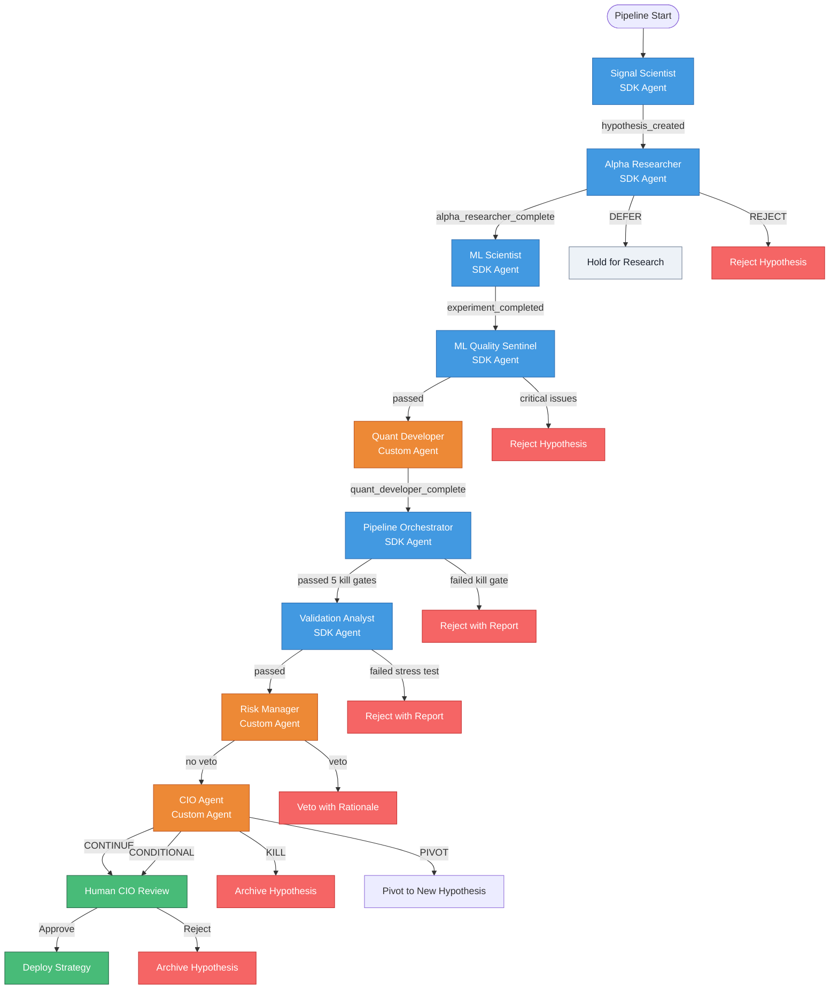
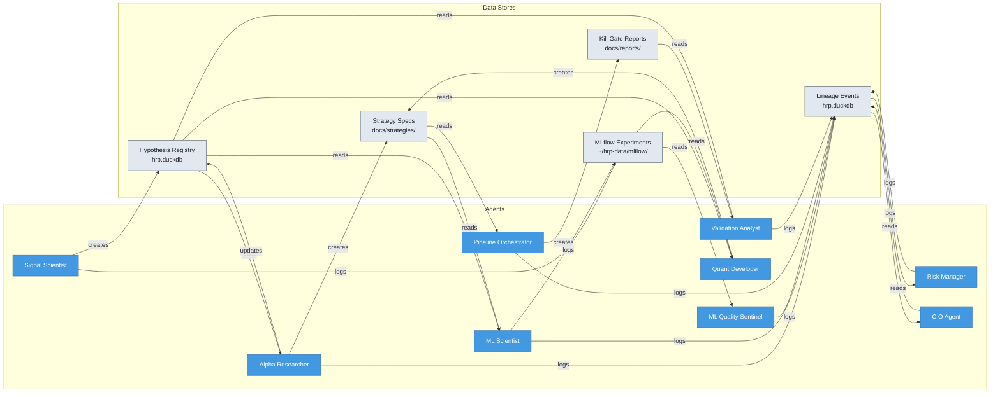
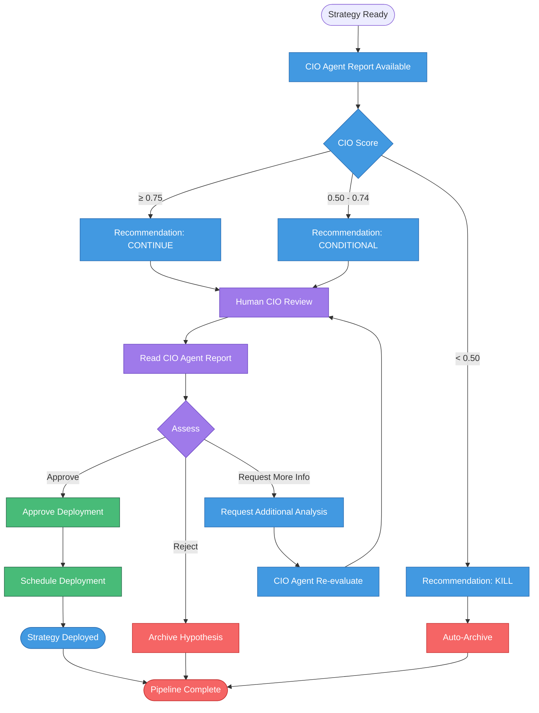

# HRP Research Agents - Decision Pipeline

## Overview

This document describes the complete decision flow from signal discovery to strategy deployment in the HRP (Hedgefund Research Platform). The pipeline is event-driven, using lineage events to trigger downstream agents automatically. It ensures statistical rigor, risk management, and human oversight at every critical stage.

### Key Principles

1. **Research-First**: Every strategy starts as a formal hypothesis with clear falsification criteria
2. **Reproducibility**: All experiments are versioned and re-runnable
3. **Statistical Rigor**: Walk-forward validation, significance testing, and overfitting guards enforced
4. **Audit Trail**: Full lineage from hypothesis to deployment
5. **Human Oversight**: Final deployment approval always requires human intervention
6. **Event-Driven Architecture**: Agents communicate through lineage events in the database
7. **Automated Handoffs**: Once initiated, the pipeline runs autonomously until human approval

---

## Complete Decision Pipeline Flow

```
┌─────────────────────────────────────────────────────────────────────────────────┐
│                         HRP DECISION PIPELINE                                   │
└─────────────────────────────────────────────────────────────────────────────────┘

┌──────────────────┐
│  SIGNAL SCIENTIST│ ◄─── START: Automated Signal Discovery
│  Signal Scan     │
└────────┬─────────┘
         │ Creates hypothesis
         ▼
┌──────────────────┐      ┌──────────────────────────────────────────────────────┐
│ ALPHA RESEARCHER │────▶│ DRAFT → TESTING: Economic rationale & regime check   │
│ Hypothesis Review│      │ REJECTED → Archive with feedback                     │
└────────┬─────────┘      └──────────────────────────────────────────────────────┘
         │
         ▼
┌──────────────────┐      ┌──────────────────────────────────────────────────────┐
│ ML SCIENTIST     │────▶│ TESTING → VALIDATED: Walk-forward validation pass    │
│ Model Training   │      │ TESTING → REJECTED: Stability score > 1.0           │
└────────┬─────────┘      └──────────────────────────────────────────────────────┘
         │
         ▼
┌──────────────────┐      ┌──────────────────────────────────────────────────────┐
│ ML QUALITY       │────▶│ VALIDATED → VALIDATED: No overfitting signals        │
│ SENTINEL         │      │ VALIDATED → TESTING: Flagged for overfitting         │
│ Training Audit   │      └──────────────────────────────────────────────────────┘
└────────┬─────────┘
         │
         ▼
┌──────────────────┐      ┌──────────────────────────────────────────────────────┐
│ QUANT DEVELOPER  │────▶│ VALIDATED → VALIDATED: Production backtest pass       │
│ Production       │      │ VALIDATED → TESTING: Costs too high / Sharpe too low │
│ Backtesting      │      └──────────────────────────────────────────────────────┘
└────────┬─────────┘
         │
         ▼
┌──────────────────┐      ┌──────────────────────────────────────────────────────┐
│ PIPELINE         │────▶│ VALIDATED → AUDITED: Multi-scenario validation pass   │
│ ORCHESTRATOR     │      │ VALIDATED → VALIDATED: Single scenario, limited scope │
│ Scenario Analysis│      └──────────────────────────────────────────────────────┘
└────────┬─────────┘
         │
         ▼
┌──────────────────┐      ┌──────────────────────────────────────────────────────┐
│ VALIDATION       │────▶│ AUDITED → PASSED: Stress tests pass                   │
│ ANALYST          │      │ AUDITED → FAILED: Sensitivity / stability / cost fail │
│ Stress Testing   │      └──────────────────────────────────────────────────────┘
└────────┬─────────┘
         │
         ▼
┌──────────────────┐      ┌──────────────────────────────────────────────────────┐
│ RISK MANAGER     │────▶│ PASSED → PASSED: Risk limits satisfied                │
│ Risk Review      │      │ PASSED → VETOED: Exceeds drawdown / correlation limit │
│ (VETO POWER)     │      └──────────────────────────────────────────────────────┘
└────────┬─────────┘
         │
         ▼
┌──────────────────┐      ┌──────────────────────────────────────────────────────┐
│ CIO AGENT        │────▶│ PASSED → CONTINUE: Score ≥ 0.75                     │
│ Multi-Dimensional│      │ PASSED → CONDITIONAL: Score 0.50-0.74               │
│ Scoring          │      │ PASSED → KILL: Score < 0.50                         │
└────────┬─────────┘      └──────────────────────────────────────────────────────┘
         │
         ▼
┌──────────────────┐      ┌──────────────────────────────────────────────────────┐
│ HUMAN CIO        │────▶│ CONTINUE → DEPLOYED: Human approves deployment       │
│ Final Approval   │      │ CONTINUE → ARCHIVED: Human rejects                   │
│ (ONLY HUMAN)     │      │ KILL → REJECTED: Strategy terminated                │
└──────────────────┘      └──────────────────────────────────────────────────────┘
         │
         ▼
┌──────────────────┐
│ DEPLOYED         │ ◄─── GOAL: Strategy approved for paper trading
│ STRATEGY         │
└──────────────────┘
```

### Mermaid Pipeline Diagram



---

## Event-Driven Trigger Matrix

| Source Agent | Lineage Event | Target Agent | Trigger Condition |
|--------------|---------------|--------------|-------------------|
| Signal Scientist | `hypothesis_created` | Alpha Researcher | New hypothesis in 'draft' status |
| Alpha Researcher | `alpha_researcher_complete` | ML Scientist | Hypothesis promoted to testing |
| ML Scientist | `experiment_completed` | ML Quality Sentinel | Walk-forward validation finished |
| ML Quality Sentinel | `ml_quality_sentinel_audit` | Quant Developer | Overall quality check passed |
| Quant Developer | `quant_developer_backtest_complete` | Pipeline Orchestrator | Strategy spec and backtest ready |
| Pipeline Orchestrator | `pipeline_orchestrator_complete` | Validation Analyst | All 5 kill gates passed |
| Validation Analyst | `validation_analyst_complete` | Risk Manager | Stress testing passed |
| Risk Manager | `risk_manager_assessment` | CIO Agent | No veto issued |
| CIO Agent | `cio_agent_decision` | Human CIO | Decision (CONTINUE/CONDITIONAL) ready |

---

## Agent Responsibility Matrix

| Agent | Type | Creates | Consumes | Outputs |
|-------|------|---------|----------|---------|
| **Signal Scientist** | SDK | Hypotheses (draft) | Features, prices | MLflow runs with IC scores |
| **Alpha Researcher** | SDK | Economic rationale, strategy specs | Draft hypotheses | Research notes, strategy specs |
| **ML Scientist** | SDK | Experiments | Testing hypotheses | Walk-forward validation results |
| **ML Quality Sentinel** | SDK | Audit reports | Completed experiments | Quality flags (passed/failed) |
| **Quant Developer** | Custom | Strategy specs | Audited experiments | Strategy YAML, code templates |
| **Pipeline Orchestrator** | SDK | Deployment packages | Strategy specs | Kill gate reports (5 types) |
| **Validation Analyst** | SDK | Stress test reports | Validated strategies | Pre-deployment validation |
| **Risk Manager** | Custom | Risk assessments | Stress-tested strategies | Veto or approval |
| **CIO Agent** | Custom | CIO decisions | Risk-approved strategies | 4-way decision scores |
| **Human CIO** | Human | Deployment approvals | CIO agent recommendations | Final deploy decision |

---

## Data Flow Diagram



---

## Stage-by-Stage Decision Gates

### Stage 1: Signal Discovery (Signal Scientist)

**Agent:** `SignalScientist`
**Trigger:** Weekly automated scan (Monday 7 PM ET)
**Output:** Draft hypotheses with IC scores

| Gate Type | Criteria | Pass | Fail | Next Step |
|-----------|----------|------|------|-----------|
| **Information Coefficient** | IC ≥ 0.03 | Create hypothesis | Skip signal | → Alpha Researcher |
| **Feature Count** | ≤ 50 features | Proceed | Skip signal | → Alpha Researcher |
| **Data Coverage** | ≥ 80% coverage | Proceed | Skip signal | → Alpha Researcher |

**Kill Gates:**
- IC < 0.01 (too weak to pursue)
- Feature count > 50 (overfitting risk)
- Coverage < 50% (insufficient data)

**On Fail:** Signal discarded, no hypothesis created

---

### Adaptive IC Thresholds (NEW)

**Feature:** Signal Scientist now applies strategy-class-specific IC thresholds to improve signal quality assessment.

**Strategy Classifications:**

| Strategy Class | Description | Pass Threshold | Kill Threshold |
|----------------|-------------|----------------|-----------------|
| `cross_sectional_factor` | Relative value strategies (e.g., P/E ratio) | IC ≥ 0.015 | IC < 0.005 |
| `time_series_momentum` | Trend-following strategies | IC ≥ 0.02 | IC < 0.01 |
| `ml_composite` | ML model predictions | IC ≥ 0.025 | IC < 0.01 |

**Implementation:**
- Alpha Researcher classifies hypotheses by strategy class during review
- Signal Scientist applies class-specific thresholds when creating hypotheses
- Ensures appropriate rigor for each strategy type

**Benefits:**
- More realistic expectations for different strategy types
- Reduces false positives from weak signals
- Prevents premature rejection of viable strategies

---

### Stage 2: Hypothesis Formation (Alpha Researcher)

**Agent:** `AlphaResearcher`
**Trigger:** Draft hypothesis created
**Output:** Hypothesis with economic rationale, regime context

| Gate Type | Criteria | Pass | Fail | Next Step |
|-----------|----------|------|------|-----------|
| **Economic Rationale** | Clear thesis supported | Promote to TESTING | Keep as DRAFT | → ML Scientist or Archive |
| **Regime Analysis** | Viable in ≥ 1 regime | Promote to TESTING | Keep as DRAFT | → ML Scientist or Archive |
| **Novelty Check** | Not duplicate of existing | Promote to TESTING | Archive as duplicate | → ML Scientist or Archive |

**Kill Gates:**
- No clear economic rationale
- Fails in all market regimes
- Duplicate of existing hypothesis

**On Fail:** Hypothesis remains in DRAFT or archived with feedback

**Status Change:** `DRAFT` → `TESTING`

---

### Stage 3: Model Training (ML Scientist)

**Agent:** `MLScientist`
**Trigger:** Hypothesis promoted to TESTING by Alpha Researcher
**Output:** Walk-forward validation results

| Gate Type | Criteria | Pass | Fail | Next Step |
|-----------|----------|------|------|-----------|
| **Stability Score** | ≤ 1.0 (lower = better) | Promote to VALIDATED | Demote to TESTING | → ML Quality Sentinel or Back to TESTING |
| **Mean IC** | ≥ 0.03 | Promote to VALIDATED | Demote to TESTING | → ML Quality Sentinel or Back to TESTING |
| **Statistical Significance** | p-value < 0.05 | Promote to VALIDATED | Demote to TESTING | → ML Quality Sentinel or Back to TESTING |
| **Fold Consistency** | No sign flips across folds | Promote to VALIDATED | Demote to TESTING | → ML Quality Sentinel or Back to TESTING |

**Kill Gates:**
- Stability score > 2.0 (highly unstable)
- Mean IC < 0.01 (too weak)
- Train Sharpe > 3.0 (suspiciously good, likely overfit)

**On Fail:**
- Hypothesis demoted to `TESTING` with feedback
- MLflow run logged with failure reason
- Re-submission allowed after parameter adjustment

**Status Change:** `TESTING` → `VALIDATED`

---

### Stage 4: Training Audit (ML Quality Sentinel)

**Agent:** `MLQualitySentinel`
**Trigger:** Hypothesis promoted to VALIDATED
**Output:** Audit report with overfitting checks

| Gate Type | Criteria | Pass | Fail | Next Step |
|-----------|----------|------|------|-----------|
| **Sharpe Decay** | Train/Test Sharpe decay ≤ 50% | No flag | Flag for overfitting | → Quant Developer or Back to TESTING |
| **Target Leakage** | Feature-target correlation < 0.95 | No flag | Flag for leakage | → Quant Developer or Back to TESTING |
| **Feature Count** | ≤ 50 features | No flag | Flag for overfitting | → Quant Developer or Back to TESTING |
| **Fold Stability** | CV of IC ≤ 2.0 | No flag | Flag for instability | → Quant Developer or Back to TESTING |
| **Suspicious Results** | IC ≤ 0.15 AND Sharpe ≤ 3.0 | No flag | Flag for too good to be true | → Quant Developer or Back to TESTING |

**Kill Gates:**
- Sharpe decay > 50% (severe overfitting)
- Target leakage correlation > 0.95 (data leak)
- Feature count > 50 (overfitting risk)
- Suspiciously good: IC > 0.15 OR Sharpe > 3.0

**On Fail:**
- Hypothesis demoted to `TESTING` with audit report
- Specific issues identified (e.g., "Feature count: 55")
- Re-submission allowed after fixing issues

**Status Change:** `VALIDATED` → `TESTING` (if flagged) or `VALIDATED` (if passes)

---

### Stage 5: Production Backtesting (Quant Developer)

**Agent:** `QuantDeveloper`
**Trigger:** Hypothesis in VALIDATED status (passed audit)
**Output:** Production backtest with realistic costs

| Gate Type | Criteria | Pass | Fail | Next Step |
|-----------|----------|------|------|-----------|
| **Baseline Sharpe** | ≥ 0.5 | Promote to VALIDATED | Demote to TESTING | → Pipeline Orchestrator or Back to TESTING |
| **Max Drawdown** | ≤ 30% | Promote to VALIDATED | Demote to TESTING | → Pipeline Orchestrator or Back to TESTING |
| **Execution Costs** | Slippage ≤ 10 bps, turnover ≤ 50% | Promote to VALIDATED | Demote to TESTING | → Pipeline Orchestrator or Back to TESTING |
| **Trade Frequency** | ≥ 100 trades/year | Promote to VALIDATED | Demote to TESTING | → Pipeline Orchestrator or Back to TESTING |

**Kill Gates:**
- Baseline Sharpe < 0.5 (below minimum threshold)
- Max drawdown > 30% (excessive risk)
- Slippage > 20 bps (execution costs too high)
- Turnover > 100% (excessive trading)

**On Fail:**
- Hypothesis demoted to `TESTING` with cost analysis
- Specific issues identified (e.g., "Max drawdown: 35%")
- Re-submission allowed after parameter adjustment

**Status Change:** `VALIDATED` → `VALIDATED` (no change, but ready for orchestrator)

---

### Stage 6: Experiment Orchestration (Pipeline Orchestrator)

**Agent:** `PipelineOrchestrator`
**Trigger:** Validated hypothesis with production backtest
**Output:** Multi-scenario validation results

| Gate Type | Criteria | Pass | Fail | Next Step |
|-----------|----------|------|------|-----------|
| **Scenario Coverage** | ≥ 3 scenarios tested | Promote to AUDITED | Keep as VALIDATED | → Validation Analyst |
| **Cross-Scenario Consistency** | Sharpe CV ≤ 0.30 across scenarios | Promote to AUDITED | Keep as VALIDATED | → Validation Analyst |
| **Worst-Case Performance** | Min Sharpe ≥ 0.3 across scenarios | Promote to AUDITED | Keep as VALIDATED | → Validation Analyst |

**Kill Gates:** None (single-scenario validation allowed for limited scope)

**On Fail:**
- Hypothesis remains in `VALIDATED` status
- Proceeds to Validation Analyst with limited scope warning
- Can be re-tested with additional scenarios later

**Status Change:** `VALIDATED` → `AUDITED` (multi-scenario) or `VALIDATED` (single-scenario)

---

### Stage 7: Stress Testing (Validation Analyst)

**Agent:** `ValidationAnalyst`
**Trigger:** Hypothesis in AUDITED or VALIDATED status
**Output:** Stress test report with sensitivity analysis

| Gate Type | Criteria | Pass | Fail | Next Step |
|-----------|----------|------|------|-----------|
| **Parameter Sensitivity** | Varied/Baseline Sharpe ≥ 0.5 | Promote to PASSED | Demote to VALIDATED | → Risk Manager or Back to TESTING |
| **Time Stability** | ≥ 67% of periods profitable | Promote to PASSED | Demote to VALIDATED | → Risk Manager or Back to TESTING |
| **Regime Stability** | ≥ 2 of 3 regimes profitable | Promote to PASSED | Demote to VALIDATED | → Risk Manager or Back to TESTING |
| **Execution Realism** | Survives slippage stress test | Promote to PASSED | Demote to VALIDATED | → Risk Manager or Back to TESTING |

**Kill Gates:**
- Parameter sensitivity ratio < 0.3 (highly fragile)
- < 33% of periods profitable (fails in most time periods)
- Profitable in 0 regimes (fails in all market conditions)

**On Fail:**
- Hypothesis demoted to `VALIDATED` with stress test report
- Specific failures identified (e.g., "Fails in bear market regime")
- Re-submission allowed after strategy refinement

**Status Change:** `AUDITED` → `PASSED`

---

### Stage 8: Risk Review (Risk Manager)

**Agent:** `RiskManager`
**Trigger:** Hypothesis in PASSED status
**Output:** Risk assessment with portfolio impact analysis

**IMPORTANT:** Risk Manager has **VETO POWER** - can reject strategies but CANNOT approve deployment

| Gate Type | Criteria | Pass | Fail | Next Step |
|-----------|----------|------|------|-----------|
| **Drawdown Risk** | Max DD ≤ 15%, Duration ≤ 126 days | No veto | VETO | → CIO Agent or Archive |
| **Concentration Risk** | ≥ 10 positions, No position > 10% | No veto | VETO | → CIO Agent or Archive |
| **Sector Exposure** | No sector > 25% of portfolio | No veto | VETO | → CIO Agent or Archive |
| **Correlation Check** | Correlation with existing positions ≤ 0.60 | No veto | VETO | → CIO Agent or Archive |
| **Volatility Check** | Strategy volatility ≤ 20% | No veto | VETO | → CIO Agent or Archive |

**Kill Gates:**
- Max drawdown > 20% (excessive risk)
- Max drawdown duration > 252 days (1 year recovery time)
- Position correlation > 0.70 (no diversification value)
- Sector exposure > 30% (concentrated bet)

**On Fail:**
- Hypothesis marked as `VETOED` by Risk Manager
- Email alert sent to human CIO with veto rationale
- Can be overridden by Human CIO (rare)
- Otherwise archived with veto reason

**Status Change:** `PASSED` → `PASSED` (if no veto) or `PASSED` → `VETOED` (if vetoed)

---

### Stage 9: CIO Scoring (CIO Agent)

**Agent:** `CIOAgent`
**Trigger:** Hypothesis in PASSED status (passed Risk Manager)
**Output:** Multi-dimensional score with deployment recommendation

**Decision Thresholds:**
- **CONTINUE** (Score ≥ 0.75): Recommended for deployment
- **CONDITIONAL** (Score 0.50-0.74): Proceed with caution
- **KILL** (Score < 0.50): Not viable, terminate
- **PIVOT** (Special Case): Good idea but needs major rework

| Dimension | Weight | Criteria | Max Score |
|-----------|--------|----------|-----------|
| **Statistical** | 40% | Sharpe, Stability, IC, Fold CV | 1.0 |
| **Risk** | 25% | Max DD, Volatility, Regime stable, Sharpe decay | 1.0 |
| **Economic** | 20% | Thesis strength, Regime fit, Novelty, Black box count | 1.0 |
| **Cost** | 15% | Slippage survival, Turnover, Capacity, Execution complexity | 1.0 |

**Score Calculation:**
```
Total Score = (Statistical × 0.40) + (Risk × 0.25) + (Economic × 0.20) + (Cost × 0.15)
```

**Decision Outcomes:**

| Decision | Score Range | Action |
|----------|-------------|--------|
| **CONTINUE** | ≥ 0.75 | Forward to Human CIO for deployment approval |
| **CONDITIONAL** | 0.50 - 0.74 | Forward to Human CIO with caveats |
| **KILL** | < 0.50 | Archive hypothesis, terminate development |
| **PIVOT** | Any | Ask Human CIO for direction (good idea, bad execution) |

**On KILL:**
- Hypothesis archived with CIO Agent rationale
- All MLflow runs preserved for analysis
- Can be revived later if market conditions change

**On PIVOT:**
- Hypothesis paused pending human direction
- CIO Agent provides pivot suggestions (e.g., "Try different sector focus")

**On CONTINUE/CONDITIONAL:**
- Forwarded to Human CIO for final decision
- Full dossier prepared: all agent reports, scores, rationale

**Status Change:** `PASSED` → `PASSED` (no change, waiting for human)

---

### Stage 10: Human Approval (Human CIO)

**Agent:** Human (ONLY stage requiring human intervention)
**Trigger:** CIO Agent recommends CONTINUE or CONDITIONAL
**Output:** Final deployment decision

**Human Approval Points:**

1. **Final Deployment Approval** (ONLY HUMAN CAN DO THIS)
   - Reviews CIO Agent recommendation
   - Examines full dossier (all agent reports)
   - Considers portfolio context, market conditions
   - Makes final GO/NO-GO decision

2. **Override Risk Manager Veto** (RARE)
   - Can override Risk Manager veto (with documented reason)
   - Requires explicit justification in system
   - Logged in audit trail

3. **Strategic Direction** (ONGOING)
   - Sets research priorities (e.g., "Focus on low-volatility strategies")
   - Adjusts risk limits (e.g., "Lower max drawdown to 12%")
   - Provides pivot direction for PIVOT cases

**Decision Outcomes:**

| Decision | Action | Status Change |
|----------|--------|---------------|
| **APPROVE** | Deploy to paper trading | `PASSED` → `DEPLOYED` |
| **REJECT** | Archive with reason | `PASSED` → `REJECTED` |
| **CONDITIONAL** | Request modifications | `PASSED` → `TESTING` (with conditions) |

**On APPROVE:**
- Strategy deployed to paper trading portfolio
- Daily performance monitoring enabled
- Quarterly review scheduled

**On REJECT:**
- Hypothesis archived with human rationale
- Full preservation of all research (MLflow, lineage, reports)
- Can be revived later if conditions change

**On CONDITIONAL:**
- Hypothesis sent back to TESTING with specific requirements
- Re-enters pipeline at appropriate stage
- Must address all conditions before re-submission

---

## Summary of All Kill Gates

| Stage | Kill Gate | Threshold | Action |
|-------|-----------|-----------|--------|
| **Signal Discovery** | IC too weak | IC < 0.01 | Discard signal |
| **Signal Discovery** | Too many features | > 50 features | Discard signal |
| **Signal Discovery** | Insufficient data | Coverage < 50% | Discard signal |
| **Hypothesis Formation** | No rationale | No economic thesis | Archive |
| **Hypothesis Formation** | Fails all regimes | Viable in 0 regimes | Archive |
| **Hypothesis Formation** | Duplicate | Copy of existing | Archive |
| **Model Training** | Unstable | Stability score > 2.0 | Demote to TESTING |
| **Model Training** | Too weak | Mean IC < 0.01 | Demote to TESTING |
| **Model Training** | Suspicious | Train Sharpe > 3.0 | Demote to TESTING |
| **Training Audit** | Sharpe decay | Decay > 50% | Demote to TESTING |
| **Training Audit** | Target leakage | Correlation > 0.95 | Demote to TESTING |
| **Training Audit** | Feature count | > 50 features | Demote to TESTING |
| **Training Audit** | Too good to be true | IC > 0.15 OR Sharpe > 3.0 | Demote to TESTING |
| **Production Backtest** | Below threshold | Baseline Sharpe < 0.5 | Demote to TESTING |
| **Production Backtest** | Excessive risk | Max DD > 30% | Demote to TESTING |
| **Production Backtest** | Execution costs | Slippage > 20 bps | Demote to TESTING |
| **Production Backtest** | Excessive trading | Turnover > 100% | Demote to TESTING |
| **Stress Testing** | Parameter fragile | Sensitivity < 0.3 | Demote to VALIDATED |
| **Stress Testing** | Time unstable | < 33% periods profitable | Demote to VALIDATED |
| **Stress Testing** | Regime failure | Profitable in 0 regimes | Demote to VALIDATED |
| **Risk Review** | Drawdown risk | Max DD > 20% | VETO |
| **Risk Review** | Recovery time | DD duration > 252 days | VETO |
| **Risk Review** | No diversification | Correlation > 0.70 | VETO |
| **Risk Review** | Concentrated | Sector exposure > 30% | VETO |
| **CIO Scoring** | Not viable | Total Score < 0.50 | KILL |

---

## Timeline Estimates

### Fresh Start (No Existing Research)

| Phase | Duration | Output |
|-------|----------|--------|
| **Signal Discovery** | 1 day | 10-20 draft hypotheses |
| **Hypothesis Review** | 1 day | 5-10 promoted to TESTING |
| **Model Training** | 2-3 days | 2-3 validated (60% attrition) |
| **Training Audit** | 0.5 day | 2-3 pass audit |
| **Production Backtest** | 0.5 day | 2-3 pass cost check |
| **Scenario Analysis** | 0.5 day | 2-3 audited |
| **Stress Testing** | 0.5 day | 1-2 passed |
| **Risk Review** | 0.5 day | 1-2 passed risk check |
| **CIO Scoring** | 0.5 day | 1 recommended for deployment |
| **Human Approval** | 0.5 day | 1 deployed (or rejected) |

**Total: 8 days from signal discovery to deployment decision**

### Ongoing Operations (Mature Pipeline)

| Metric | Value |
|--------|-------|
| **Throughput** | 1-3 strategies/week deployed |
| **Per-Strategy Time** | 2-3 days from draft to validated |
| **Parallel Processing** | 5-10 hypotheses in pipeline simultaneously |
| **Automation Level** | 95% automated (human only at final approval) |

### Agent Trigger Frequency

- Signal Scientist: Weekly (Monday 7 PM)
- Alpha Researcher: Event-driven (after hypothesis_created)
- ML Scientist: Event-driven (after alpha_researcher_complete)
- ML Quality Sentinel: Daily (6 AM) + event-driven
- Quant Developer: Event-driven (after ml_quality_sentinel_audit)
- Pipeline Orchestrator: Event-driven (after quant_developer_complete)
- Validation Analyst: Event-driven (after pipeline_orchestrator_complete)
- Risk Manager: Event-driven (after validation_analyst_complete)
- CIO Agent: Weekly (Friday 5 PM) + event-driven

### Bottlenecks

| Stage | Typical Delay | Mitigation |
|-------|---------------|------------|
| **Model Training** | 2-3 days (compute-intensive) | Parallel folds, GPU acceleration |
| **Human Approval** | 0-2 days (scheduling) | Batch approval meetings |
| **Bug Fixes** | 1-2 days (manual) | Code generation improvements |

---

## Rejection Paths and Feedback

### Rejection at Each Stage

| Stage | Rejection Rate | Feedback Mechanism | Re-submission |
|-------|----------------|-------------------|---------------|
| **Signal Discovery** | 80% (signals not meeting IC threshold) | Auto-discarded | N/A (no hypothesis created) |
| **Hypothesis Formation** | 50% (draft hypotheses not promoted) | Research note with rationale | Yes, after refinement |
| **Model Training** | 40% (fail stability/IC) | MLflow run + specific metrics | Yes, after parameter tuning |
| **Training Audit** | 20% (flagged for overfitting) | Audit report with issue details | Yes, after fixing issues |
| **Production Backtest** | 30% (fail cost/Sharpe checks) | Cost analysis report | Yes, after parameter adjustment |
| **Stress Testing** | 30% (fail stress tests) | Stress test report | Yes, after strategy refinement |
| **Risk Review** | 10% (vetoed by Risk Manager) | Veto rationale + email alert | Human override only |
| **CIO Scoring** | 20% (score < 0.50) | CIO Agent scorecard | No (archived) |
| **Human Approval** | 30% (rejected by human) | Human rationale (documented) | No (archived) |

**Overall Attrition:** ~95% (from signal discovery to deployment)

### Feedback Loops

1. **Automated Feedback** (Most stages)
   - Specific metrics (e.g., "Stability score: 1.45, threshold: 1.0")
   - Actionable suggestions (e.g., "Reduce feature count from 55 to < 50")
   - Preserved in lineage table for analysis

2. **Human Feedback** (Alpha Researcher, CIO Agent)
   - Economic rationale analysis
   - Strategic fit assessment
   - Pivot suggestions for PIVOT cases

3. **Re-submission Process**
   - Hypothesis remains in system (not deleted)
   - All previous runs preserved in MLflow
   - Re-enters pipeline at appropriate stage
   - Must address all feedback before re-submission

### Archive and Retrieval

**Archived Hypotheses:**
- Never deleted from database
- All MLflow runs preserved
- Can be retrieved for analysis
- Can be revived if market conditions change

**Revival Criteria:**
- Market regime change (e.g., bull → bear market)
- New data available (e.g., new fundamental metrics)
- Parameter improvement (e.g., better feature set)
- Strategic direction change (human decision)

---

## Success Metrics

### Pipeline Throughput

| Metric | Target | Current | Status |
|--------|--------|---------|--------|
| **Strategies Deployed/Week** | 1-3 | TBD | 🟡 |
| **Time from Draft to Validated** | 2-3 days | TBD | 🟡 |
| **Pipeline Utilization** | 80% | TBD | 🟡 |
| **Automated Stage Pass Rate** | 95% | TBD | 🟡 |

### Quality Metrics

| Metric | Target | Threshold | Alert Level |
|--------|--------|-----------|-------------|
| **Deployed Strategy Sharpe** | ≥ 1.0 | < 0.5 | 🔴 Critical |
| **Deployed Strategy Max DD** | ≤ 15% | > 20% | 🔴 Critical |
| **False Positive Rate** | ≤ 10% | > 20% | 🟡 Warning |
| **Strategy Survival (6mo)** | ≥ 80% | < 60% | 🟡 Warning |

### Resource Efficiency

| Metric | Target | Current | Status |
|--------|--------|---------|--------|
| **Compute Cost/Strategy** | < $10 | TBD | 🟡 |
| **Human Review Time/Week** | < 2 hours | TBD | 🟡 |
| **Pipeline Parallelization** | ≥ 5 hypotheses | TBD | 🟡 |
| **Agent Success Rate** | ≥ 95% | TBD | 🟡 |

### Risk Management

| Metric | Target | Threshold | Alert Level |
|--------|--------|-----------|-------------|
| **Risk Manager Veto Rate** | ≤ 10% | > 20% | 🟡 Warning |
| **Portfolio Correlation (avg)** | ≤ 0.50 | > 0.65 | 🔴 Critical |
| **Sector Concentration (max)** | ≤ 25% | > 30% | 🔴 Critical |
| **Drawdown (portfolio)** | ≤ 10% | > 15% | 🔴 Critical |

---

## Human Approval Points Summary

### Human Approval Flow



### Where Humans CAN Intervene

1. **Final Deployment Approval** (REQUIRED - Only human can do this)
   - Reviews CIO Agent recommendation
   - Makes final GO/NO-GO decision
   - **Cannot be delegated to agents**

2. **Override Risk Manager Veto** (RARE)
   - Can override Risk Manager veto
   - Requires documented justification
   - Logged in audit trail

3. **Strategic Direction** (ONGOING)
   - Sets research priorities
   - Adjusts risk limits
   - Provides pivot direction

### Where Humans CANNOT Intervene

1. **Agent Decision Gates** (AUTOMATED)
   - Statistical validation (ML Scientist)
   - Overfitting checks (ML Quality Sentinel)
   - Cost validation (Quant Developer)
   - Stress testing (Validation Analyst)
   - Risk assessment (Risk Manager)

2. **Kill Gates** (HARD RULES)
   - Baseline Sharpe < 0.5
   - Train Sharpe > 3.0
   - Max drawdown > 30%
   - Feature count > 50
   - Sharpe decay > 50%

**Rationale:** Kill gates are hard rules to prevent overfitting and excessive risk. Human overrides would undermine the statistical rigor of the pipeline.

---

## Appendix: Agent Types

### SDK Agents (6)
Built on standardized agent framework with common patterns:
- Signal Scientist
- Alpha Researcher
- ML Scientist
- ML Quality Sentinel
- Pipeline Orchestrator
- Validation Analyst

**Characteristics:**
- Consistent error handling
- Standardized logging to lineage
- MLflow integration
- Email alert support

### Custom Agents (2)
Domain-specific implementations:
- **Quant Developer**: Generates strategy code and specs
- **Risk Manager**: Portfolio-level risk assessment

**Characteristics:**
- Specialized domain logic
- Custom data processing
- Unique output formats

### Human Agents (2)
- **CIO Agent**: Automated decision scoring
- **Human CIO**: Final approval authority

---

## Appendix: Decision Matrix (Quick Reference)

### Decision Thresholds Cheat Sheet

| Stage | Key Metric | Pass Threshold | Kill Threshold |
|-------|------------|----------------|----------------|
| **Signal Discovery** | IC | ≥ 0.03 | < 0.01 |
| **Signal Discovery** | Feature Count | ≤ 50 | > 50 |
| **Model Training** | Stability Score | ≤ 1.0 | > 2.0 |
| **Model Training** | Mean IC | ≥ 0.03 | < 0.01 |
| **Model Training** | Train Sharpe | ≤ 3.0 | > 3.0 |
| **Training Audit** | Sharpe Decay | ≤ 50% | > 50% |
| **Training Audit** | Target Leakage | < 0.95 | ≥ 0.95 |
| **Production Backtest** | Baseline Sharpe | ≥ 0.5 | < 0.5 |
| **Production Backtest** | Max Drawdown | ≤ 30% | > 30% |
| **Production Backtest** | Slippage | ≤ 20 bps | > 20 bps |
| **Stress Testing** | Parameter Sensitivity | ≥ 0.5 | < 0.3 |
| **Stress Testing** | Time Stability | ≥ 67% | < 33% |
| **Stress Testing** | Regime Stability | ≥ 2 regimes | 0 regimes |
| **Risk Review** | Max Drawdown | ≤ 15% | > 20% |
| **Risk Review** | Position Correlation | ≤ 0.60 | > 0.70 |
| **Risk Review** | Sector Exposure | ≤ 25% | > 30% |
| **CIO Scoring** | Total Score | ≥ 0.75 | < 0.50 |

### Status Flow Diagram

```
DRAFT → TESTING → VALIDATED → AUDITED → PASSED → DEPLOYED
  ↓        ↓           ↓           ↓         ↓
ARCHIVE  REJECTED  TESTING    VALIDATED  VETOED/REJECTED
         (any)    (feedback) (limited)  (kill)
```

**Status Definitions:**
- **DRAFT**: Initial hypothesis, needs review
- **TESTING**: Under validation, not yet proven
- **VALIDATED**: Passed ML validation, needs more testing
- **AUDITED**: Passed multi-scenario validation
- **PASSED**: Passed all automated checks, ready for CIO review
- **DEPLOYED**: Approved for paper trading
- **VETOED**: Rejected by Risk Manager (human override possible)
- **REJECTED**: Terminated (archived, can be revived)

---

## Document Version

**Version:** 1.1
**Last Updated:** 2026-01-30
**Author:** HRP Research Platform
**Status:** Final

**Change Log:**
- v1.1 (2026-01-30): Merged agent-interaction-diagram.md — added Mermaid diagrams, trigger matrix, responsibility matrix, data flow diagram, agent types
- v1.0 (2026-01-29): Initial version with complete decision pipeline
