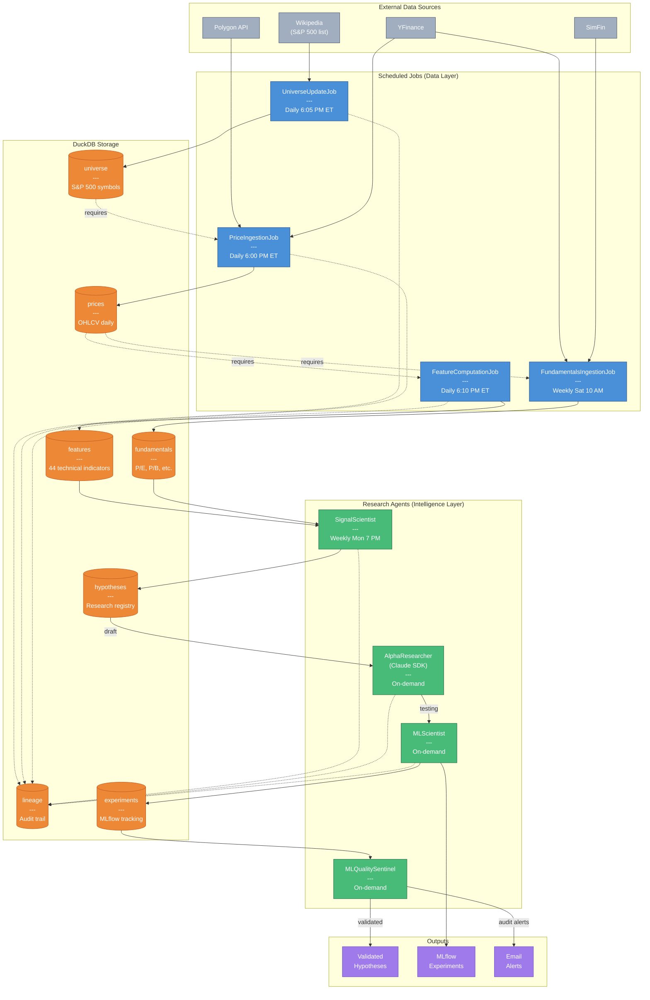
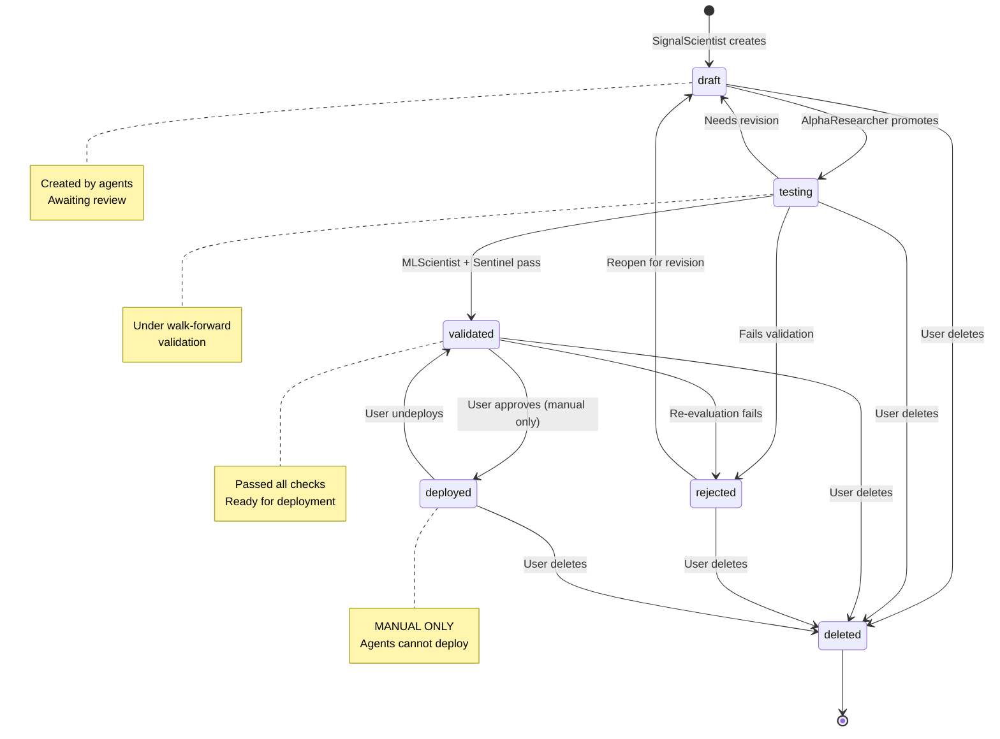
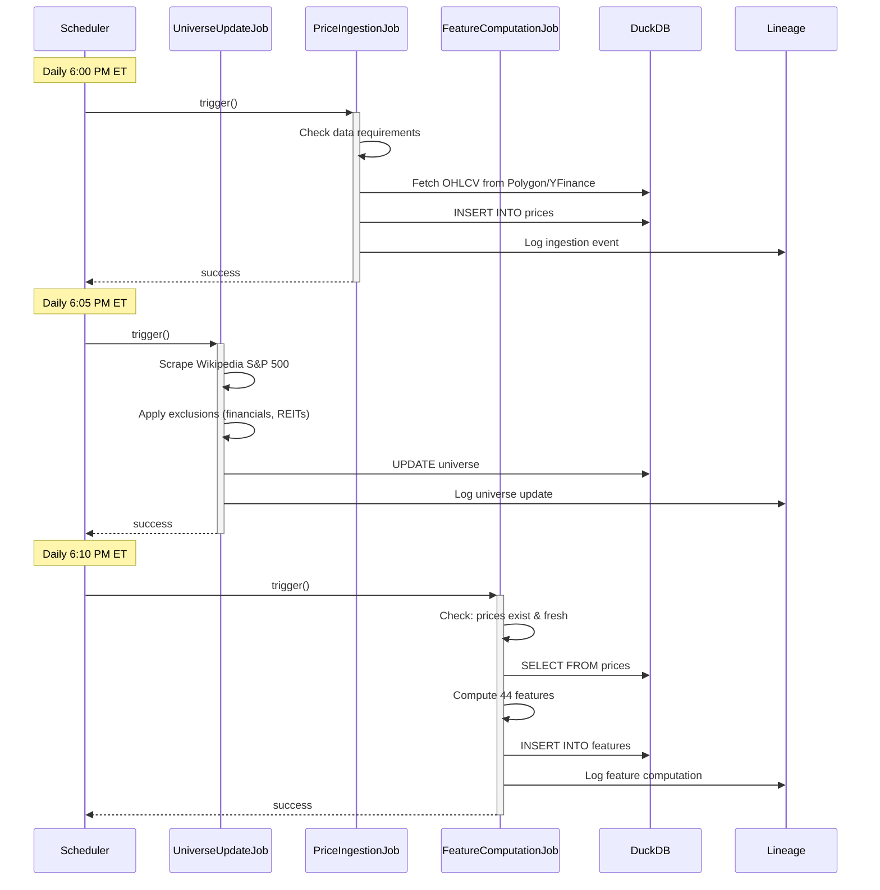

# HRP Data Pipeline Architecture

This document provides visual diagrams of the HRP (Hedgefund Research Platform) data pipeline, from raw data ingestion through hypothesis validation.

## Pipeline Overview

The HRP pipeline consists of **Jobs** (scheduled data tasks) and **Agents** (intelligent research automation). Data flows through DuckDB tables, with each stage building on the previous.

---

## Mermaid Flowchart



---

## Hypothesis Lifecycle



---

## Sequence Diagram: Daily Pipeline



---

## Sequence Diagram: Weekly Signal Scan

```mermaid
sequenceDiagram
    participant SCHED as Scheduler
    participant SS as SignalScientist
    participant AR as AlphaResearcher
    participant CLAUDE as Claude API
    participant DB as DuckDB
    participant MLF as MLflow

    Note over SCHED: Monday 7:00 PM ET

    SCHED->>+SS: trigger()
    SS->>DB: Load features for all universe symbols
    SS->>SS: Compute IC for each feature
    SS->>SS: Filter IC > 0.03

    loop For each strong signal
        SS->>DB: INSERT hypothesis (status=draft)
        SS->>MLF: Log signal scan run
    end
    SS-->>-SCHED: SignalScanReport

    Note over AR: On-demand (user or scheduled)

    AR->>+DB: SELECT hypotheses WHERE status=draft

    loop For each draft hypothesis
        AR->>+CLAUDE: Analyze economic rationale
        CLAUDE-->>-AR: Analysis + recommendation

        alt Hypothesis has merit
            AR->>DB: UPDATE status=testing
        else Lacks economic basis
            AR->>DB: UPDATE status=rejected
        end
    end
    AR-->>-DB: AlphaResearcherReport
```

---

## ASCII Art Diagram

For terminal display and code comments:

```
                          HRP DATA PIPELINE
    ============================================================

    EXTERNAL SOURCES                    SCHEDULE
    ----------------                    --------
    [Wikipedia]  ─────┐
    [Polygon  ]  ─────┼──────>  JOBS (Data Layer)
    [YFinance ]  ─────┤         =====================
    [SimFin   ]  ─────┘
                                ┌─────────────────────┐
                                │  UniverseUpdateJob  │ Daily 6:05 PM
                                │  (S&P 500 symbols)  │
                                └──────────┬──────────┘
                                           │
                                           v
                                ┌─────────────────────┐
                                │  PriceIngestionJob  │ Daily 6:00 PM
                                │  (OHLCV data)       │
                                └──────────┬──────────┘
                                           │
                                           v
                                ┌─────────────────────┐
                                │FeatureComputationJob│ Daily 6:10 PM
                                │  (44 indicators)    │
                                └──────────┬──────────┘
                                           │
    ┌─────────────────────┐               │
    │FundamentalsJob      │◄──────────────┘
    │  (P/E, P/B, etc.)   │ Weekly Sat 10 AM
    └──────────┬──────────┘
               │
    ===========│================================================
               │
               v           DUCKDB STORAGE
               │           ===============
    ┌──────────┴──────────────────────────────────────────────┐
    │                                                         │
    │  ┌──────────┐  ┌──────────┐  ┌──────────┐  ┌──────────┐ │
    │  │ universe │  │  prices  │  │ features │  │ fundmtls │ │
    │  │   (503)  │  │ (OHLCV)  │  │   (44)   │  │  (P/E..) │ │
    │  └────┬─────┘  └────┬─────┘  └────┬─────┘  └────┬─────┘ │
    │       │             │             │             │       │
    │  ┌────┴─────────────┴─────────────┴─────────────┴─────┐ │
    │  │                   hypotheses                       │ │
    │  │  draft -> testing -> validated -> deployed         │ │
    │  └─────────────────────┬──────────────────────────────┘ │
    │                        │                                │
    │  ┌─────────────────────┴──────────────────────────────┐ │
    │  │                    lineage                         │ │
    │  │  (audit trail for all operations)                  │ │
    │  └────────────────────────────────────────────────────┘ │
    │                                                         │
    └──────────────────────────┬──────────────────────────────┘
                               │
    ===========================│====================================
                               │
                               v
                        RESEARCH AGENTS
                        ===============

    ┌─────────────────────────────────────────────────────────────┐
    │                                                             │
    │  ┌─────────────────┐      ┌─────────────────┐               │
    │  │ SignalScientist │      │ AlphaResearcher │               │
    │  │ ─────────────── │      │ ─────────────── │               │
    │  │ Weekly Mon 7 PM │─────>│ Claude SDK      │               │
    │  │ IC > 0.03 scan  │      │ Economic review │               │
    │  │ Creates: draft  │      │ Promotes:testing│               │
    │  └─────────────────┘      └────────┬────────┘               │
    │                                    │                        │
    │                                    v                        │
    │                        ┌─────────────────────┐              │
    │                        │    MLScientist      │              │
    │                        │ ─────────────────── │              │
    │                        │ Walk-forward valid. │              │
    │                        │ Cross-validation    │              │
    │                        └────────┬────────────┘              │
    │                                 │                           │
    │                                 v                           │
    │                        ┌─────────────────────┐              │
    │                        │ MLQualitySentinel   │              │
    │                        │ ─────────────────── │              │
    │                        │ Overfitting audit   │              │
    │                        │ Sharpe decay check  │              │
    │                        └────────┬────────────┘              │
    │                                 │                           │
    └─────────────────────────────────│───────────────────────────┘
                                      │
                                      v
    ==================================================================
                               OUTPUTS
                               =======

    ┌──────────────────┐  ┌──────────────────┐  ┌──────────────────┐
    │    VALIDATED     │  │     MLFLOW       │  │     ALERTS       │
    │   HYPOTHESES     │  │   EXPERIMENTS    │  │     (Email)      │
    │ ──────────────── │  │ ──────────────── │  │ ──────────────── │
    │ Ready for manual │  │ Full experiment  │  │ Critical issues  │
    │ deployment       │  │ tracking & logs  │  │ Audit failures   │
    └──────────────────┘  └──────────────────┘  └──────────────────┘

    ==================================================================

    LEGEND
    ------
    [Job]     = Scheduled data ingestion task
    [Agent]   = Intelligent research automation
    ─────>    = Data flow
    - - - ->  = Lineage/audit logging


    HYPOTHESIS LIFECYCLE
    ====================

    ┌─────────┐   promote   ┌─────────┐   validate  ┌───────────┐
    │  DRAFT  │ ──────────> │ TESTING │ ──────────> │ VALIDATED │
    └─────────┘             └─────────┘             └───────────┘
         ^                       │                       │
         │        revise         │                       │ deploy
         └───────────────────────┘                       │ (USER ONLY)
                                                         v
                                                  ┌───────────┐
                                                  │ DEPLOYED  │
                                                  └───────────┘

    Status Meanings:
    ----------------
    DRAFT     - Created by SignalScientist, awaiting review
    TESTING   - Promoted by AlphaResearcher, under validation
    VALIDATED - Passed walk-forward + overfitting checks
    DEPLOYED  - Live in production (MANUAL APPROVAL ONLY)
    REJECTED  - Failed validation, can be reopened
    DELETED   - Terminal state, removed from active use
```

---

## Component Reference

### Jobs (Data Layer)

| Job | Schedule | Input | Output | Dependencies |
|-----|----------|-------|--------|--------------|
| `UniverseUpdateJob` | Daily 6:05 PM ET | Wikipedia | `universe` table | None |
| `PriceIngestionJob` | Daily 6:00 PM ET | Polygon/YFinance | `prices` table | `universe` data exists |
| `FeatureComputationJob` | Daily 6:10 PM ET | `prices` table | `features` table | Recent prices exist |
| `FundamentalsIngestionJob` | Weekly Sat 10 AM | SimFin/YFinance | `fundamentals` table | Recent prices exist |

### Agents (Intelligence Layer)

| Agent | Trigger | Input | Output | Claude SDK |
|-------|---------|-------|--------|------------|
| `SignalScientist` | Weekly Mon 7 PM | `features` table | Draft hypotheses | No |
| `AlphaResearcher` | On-demand | Draft hypotheses | Testing hypotheses | Yes |
| `MLScientist` | On-demand | Testing hypotheses | Experiment results | No |
| `MLQualitySentinel` | On-demand | Experiments | Audit reports | No |

### DuckDB Tables

| Table | Description | Key Columns |
|-------|-------------|-------------|
| `universe` | Active trading symbols | `symbol`, `sector`, `is_active` |
| `prices` | Daily OHLCV data | `symbol`, `date`, `open`, `high`, `low`, `close`, `volume` |
| `features` | 44 computed indicators | `symbol`, `date`, `feature_name`, `value` |
| `fundamentals` | Company financials | `symbol`, `date`, `pe_ratio`, `pb_ratio`, etc. |
| `hypotheses` | Research registry | `hypothesis_id`, `status`, `thesis`, `created_by` |
| `lineage` | Audit trail | `event_type`, `entity_id`, `actor`, `timestamp` |
| `experiments` | MLflow tracking | `experiment_id`, `run_id`, `metrics` |

---

## Key Design Principles

1. **Data Requirements over Job Dependencies**: Jobs check for data existence rather than whether predecessor jobs ran
2. **Lineage Everywhere**: Every operation logs to the lineage table for full audit trail
3. **Agent Permissions**: Agents can create/analyze but never deploy (user approval required)
4. **Hypothesis Lifecycle**: Formal state machine prevents premature deployment
5. **Statistical Rigor**: Walk-forward validation and overfitting checks are mandatory

---

## Related Documentation

- [CLAUDE.md](/CLAUDE.md) - Main project instructions
- [Project Status](/docs/plans/Project-Status.md) - Development roadmap
- [Operations Guide](/docs/operations/) - Scheduler setup and monitoring
