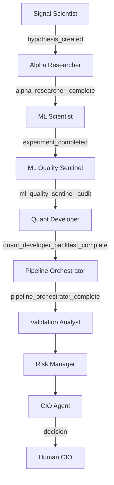

# Agent Redesign Documentation Update Plan

> **For Claude:** REQUIRED SUB-SKILL: Use superpowers:executing-plans to implement this plan task-by-task.

**Goal:** Update all agent documentation to reflect the latest agent redesign decisions including Alpha Researcher strategy generation, Pipeline Orchestrator, and updated decision pipeline.

**Architecture:** Comprehensive documentation refresh across design docs, operations docs, and new individual agent specifications.

**Tech Stack:** Markdown documentation, existing HRP codebase

---

## Context

The agent implementation has evolved with recent changes:
- **Alpha Researcher** now includes strategy generation (3 sources: Claude ideation, literature patterns, pattern mining)
- **Pipeline Orchestrator** added as a new agent for parallel experiment execution with early kill gates
- Updated agent pipeline with new event types: `ALPHA_RESEARCHER_COMPLETE`, `PIPELINE_ORCHESTRATOR_COMPLETE`, `KILL_GATE_TRIGGERED`
- Decision pipeline now flows: Signal Scientist → Alpha Researcher → ML Scientist → ML Quality Sentinel → Quant Developer → Pipeline Orchestrator → Validation Analyst → Risk Manager → CIO Agent

---

## Task 1: Create Individual Agent Specification Files

**Files:**
- Create: `hrp/agents/specs/alpha_researcher_spec.md`
- Create: `hrp/agents/specs/quant_developer_spec.md`
- Create: `hrp/agents/specs/pipeline_orchestrator_spec.md`
- Create: `hrp/agents/specs/README.md` (agent spec index)

**Step 1: Create agent specs directory**

Run:
```bash
mkdir -p hrp/agents/specs
```

Expected: Directory created

**Step 2: Create Alpha Researcher spec file**

Write: `hrp/agents/specs/alpha_researcher_spec.md`

Content includes:
- Overview & Identity (actor, type, role, trigger, upstream, downstream)
- Purpose (responsibilities and non-responsibilities)
- Core Responsibilities (hypothesis review, strategy generation, portfolio context, baseline definition, failure mode analysis)
- Outputs (hypothesis registry updates, strategy spec docs, research notes, lineage events)
- Configuration (AlphaResearcherConfig with new generation settings)
- Methods (existing review methods + new generation methods)
- Example strategy spec document
- Explicit non-responsibilities

**Step 3: Create Quant Developer spec file**

Write: `hrp/agents/specs/quant_developer_spec.md`

Content includes:
- Overview & Identity
- Purpose (engineering correctness, NOT strategy invention)
- Core Responsibilities (backtesting, execution & cost modeling, performance & scalability, research infrastructure, engineering guardrails)
- Outputs (backtest engine, cost models, performance suite, test suite, benchmarks, infra notes)
- Configuration (QuantDeveloperConfig)
- Methods (_backtest_hypothesis, _load_strategy_spec, _fetch_required_data, etc.)
- Explicit non-responsibilities

**Step 4: Create Pipeline Orchestrator spec file**

Write: `hrp/agents/specs/pipeline_orchestrator_spec.md`

Content includes:
- Overview & Identity
- Purpose (coordination & resource optimization, NOT strategy creation or backtesting)
- Core Responsibilities (baseline execution, parallel experiment execution, early kill gates, artifact logging)
- Outputs (baseline results, parallel experiments, kill gate reports, resource summary)
- Configuration (PipelineOrchestratorConfig)
- Methods (_run_baselines, _build_experiment_queue, _run_parallel_experiments, _apply_kill_gates, _write_kill_gate_report)
- Explicit non-responsibilities

**Step 5: Create agent spec README**

Write: `hrp/agents/specs/README.md`

Content:
- Index of all agent specs
- Quick reference table (agent, type, status, spec file)
- Link to main design documentation

---

## Task 2: Update Research Agents Design Document

**Files:**
- Modify: `/Users/fer/Documents/GitHub/HRP/docs/agents/2026-01-25-research-agents-design.md`

**Step 1: Update header status**

Change line 5:
```markdown
**Status:** Implementation Complete (10/10 agents built including Pipeline Orchestrator)
```

**Step 2: Update Agent Implementation Matrix table (lines 29-39)**

Replace with:
```markdown
### Agent Implementation Matrix

| Agent | Type | Status | Reasoning |
|-------|------|--------|-----------|
| Signal Scientist | Custom | ✅ Built | Deterministic: calculate IC, threshold check |
| ML Scientist | Custom | ✅ Built | Deterministic: walk-forward validation pipeline |
| Alpha Researcher | SDK | ✅ Built (Enhanced) | Needs reasoning: economic analysis + strategy generation |
| ML Quality Sentinel | Custom | ✅ Built | Deterministic: run checklist of validations |
| Validation Analyst | Hybrid | ✅ Built | Mix: deterministic tests + reasoning for edge cases |
| Risk Manager | Custom | ✅ Built | Independent oversight: drawdown, concentration, limits |
| Quant Developer | Custom | ✅ Built | Engineering: backtesting, cost modeling, performance |
| **Pipeline Orchestrator** | Custom | ✅ Built (NEW) | Coordination: baselines, parallel execution, kill gates |
| Report Generator | SDK | ✅ Built | Synthesis: narrative construction from findings |
| **CIO Agent** | SDK | ✅ Built | Autonomous scoring across 4 dimensions |
```

**Step 3: Update agent count in decision table (line 20)**

Change:
```markdown
| Agent count | 10 agents (9 from Option A + Pipeline Orchestrator + CIO Agent) |
```

**Step 4: Update Alpha Researcher role definition (lines 266-273)**

Replace with:
```markdown
### 1. Alpha Researcher
**Focus:** Hypothesis development, strategy design, regime awareness, **NEW: strategy generation from economic principles**
**Inputs:** Market data, features, existing hypotheses
**Outputs:** New hypotheses with thesis, prediction, falsification criteria, **strategy specification documents**
**Schedule:** Weekly discovery runs + on-demand
**Uses:** `create_hypothesis`, `get_features`, `get_prices`, `generate_strategies()`, `_write_strategy_spec_doc()`
**NEW Capabilities:**
- `generate_strategies()`: Generate novel concepts from Claude ideation, literature patterns, pattern mining
- `_write_strategy_spec_doc()`: Create markdown specs in `docs/strategies/`
- Three generation sources: claude_ideation, literature_patterns, pattern_mining

> **Detailed spec:** See [Alpha Researcher Specification](../../hrp/agents/specs/alpha_researcher_spec.md)
```

**Step 5: Update Quant Developer role definition (lines 297-302)**

Replace with:
```markdown
### 6. Quant Developer (✅ Built)
**Focus:** Backtest implementation, execution cost modeling, performance optimization, infrastructure engineering
**Inputs:** Strategy specifications (from Alpha Researcher), validated ML models
**Outputs:** Production backtests with realistic costs, parameter variations, performance benchmarks, infrastructure notes
**Schedule:** Event-driven (after ML Quality Sentinel) + weekly maintenance
**Uses:** `run_backtest`, VectorBT, cost modeling APIs, MLflow logging
**Key Methods:**
- `_backtest_hypothesis()`: Run full backtest with IBKR-style costs
- `_run_parameter_variations()`: Test robustness across parameters
- `_calculate_cost_sensitivity()`: Analyze impact of cost variations

> **Detailed spec:** See [Quant Developer Specification](../../hrp/agents/specs/quant_developer_spec.md)
```

**Step 6: Add Pipeline Orchestrator role definition (after Quant Developer, before Risk Manager)**

Add:
```markdown
### 7. Pipeline Orchestrator (✅ Built - NEW)
**Focus:** Baseline execution, parallel experiment coordination, early kill gates for compute optimization
**Inputs:** Hypotheses with Quant Developer backtests
**Outputs:** Baseline comparisons, parallel experiment results, kill gate reports, resource savings metrics
**Schedule:** Event-driven (after Quant Developer) + daily orchestration
**Uses:** `_run_baselines()`, `_build_experiment_queue()`, `_run_parallel_experiments()`, `_apply_kill_gates()`
**Key Features:**
- Sequential baseline execution (equal-weight, buy-and-hold SPY)
- Parallel parameter sweeps with resource management
- Early kill gates: baseline Sharpe < 0.5, train Sharpe > 3.0, max drawdown > 30%, feature count > 50
- Time savings tracking and reporting

> **Detailed spec:** See [Pipeline Orchestrator Specification](../../hrp/agents/specs/pipeline_orchestrator_spec.md)
```

**Step 7: Re-number subsequent agents**

Update Risk Manager to #8, Validation Analyst to #9, Report Generator to #10, CIO Agent to #11 (or keep CIO Agent as special).

**Step 8: Update workflow example (lines 346-380)**

Replace with updated pipeline:
```markdown
### Workflow Example
```
1. Signal Scientist discovers promising momentum signal
   → Creates draft hypothesis HYP-2026-042

2. Alpha Researcher picks up HYP-2026-042
   → Refines thesis, adds falsification criteria
   → [NEW] Generates complementary strategy concepts from literature patterns
   → Writes strategy spec to docs/strategies/
   → Updates status to "testing"

3. ML Scientist sees "testing" hypothesis
   → Runs walk-forward validation
   → Logs results to MLflow

4. ML Quality Sentinel audits the training
   → Checks for leakage, overfitting
   → Adds audit report to lineage

5. [NEW] Quant Developer runs production backtests
   → Implements strategy with realistic IBKR costs
   → Runs parameter variations
   → Calculates cost sensitivity
   → Logs quant_developer_backtest_complete event

6. [NEW] Pipeline Orchestrator coordinates experiments
   → Runs baselines first (sequential)
   → Queues parallel parameter sweeps
   → Applies early kill gates (saves compute)
   → Logs pipeline_orchestrator_complete event

7. Validation Analyst runs stress tests
   → Parameter sensitivity, regime analysis
   → Updates hypothesis with validation results

8. Risk Manager reviews validated hypothesis
   → Checks risk limits, portfolio fit
   → Approves or flags concerns

9. CIO Agent scores validated hypothesis across 4 dimensions:
   - Statistical: Sharpe, stability, IC
   - Risk: Max DD, volatility, regime stability
   - Economic: Thesis quality, uniqueness
   - Cost: Turnover, capacity, execution complexity
   → Decision: CONTINUE/CONDITIONAL/KILL/PIVOT

10. Report Generator summarizes for human CIO review
    → Weekly report includes HYP-2026-042 findings
    → Human CIO makes final deployment decision
```
```

**Step 9: Update implementation status checklist (lines 416-432)**

Change line 31:
```markdown
| Quant Developer | Custom | ✅ Built | Engineering: backtesting pipeline exists |
```

Add after line 31:
```markdown
| **Pipeline Orchestrator** | Custom | ✅ Built | Coordination: baselines, parallel execution, kill gates |
```

**Step 10: Update document history**

Add at end:
```markdown
- **2026-01-29:** Major update - Alpha Researcher enhanced with strategy generation, Pipeline Orchestrator added, decision pipeline updated with 10 agents
```

---

## Task 3: Update Research Agents Operations Document

**Files:**
- Modify: `/Users/fer/Documents/GitHub/HRP/docs/agents/2026-01-25-research-agents-operations.md`

**Step 1: Update overview section (lines 1-23)**

Update agent list to include Pipeline Orchestrator:
```markdown
**Agents:**
1. Signal Scientist - Feature discovery and hypothesis creation
2. Alpha Researcher - Hypothesis refinement, regime analysis, **strategy generation**
3. ML Scientist - Model training and walk-forward validation
4. ML Quality Sentinel - Experiment auditing (overfitting, leakage)
5. Quant Developer - Strategy backtesting with realistic costs
6. **Pipeline Orchestrator** - Baseline execution, parallel experiments, kill gates
7. Validation Analyst - Stress testing and robustness checks
8. Risk Manager - Portfolio-level risk review
9. Report Generator - Research synthesis and reporting
10. **CIO Agent** - Autonomous hypothesis scoring and deployment decisions
```

**Step 2: Update weekly cycle table (lines 63-73)**

Replace with:
```markdown
| Day | Agent Activity |
|-----|----------------|
| **Monday 9 AM** | **Alpha Researcher**: Review drafts + generate new strategies |
| **Tuesday 6 AM** | **Pipeline Orchestrator**: Coordinate baselines + parallel experiments |
| **Tuesday-Wednesday** | ML Scientist: Walk-forward validation on testing hypotheses |
| **Thursday** | Validation Analyst: Stress tests + Risk Manager: Portfolio review |
| **Friday 5 PM** | **CIO Agent**: Score validated hypotheses + Report Generator: Weekly summary |
| **Saturday** | Fundamentals ingestion (weekly job) |
| **Sunday** | System idle |
```

**Step 3: Update Monday section (lines 74-79)**

Replace with:
```markdown
### Monday - Alpha Researcher (Enhanced)
- Reviews all draft hypotheses from Signal Scientist
- Adds regime awareness: "Does this signal work in high-vol vs low-vol?"
- **[NEW] Generates 3 new strategy concepts from:**
  - Claude ideation (novel concepts from economic first principles)
  - Literature patterns (academic factors: post-earnings drift, momentum, low volatility)
  - Pattern mining (extensions of existing successful hypotheses)
- **[NEW] Writes strategy spec documents to `docs/strategies/`**
- Refines falsification criteria to be testable
- Promotes promising ones to `status='testing'`
- Logs `ALPHA_RESEARCHER_COMPLETE` event
```

**Step 4: Add Pipeline Orchestrator section (after Monday, before Tuesday)**

Add:
```markdown
### Tuesday - Pipeline Orchestrator (NEW)
- Runs baseline experiments first (sequential):
  - Equal-weight long/short
  - Buy-and-hold SPY
  - Market-cap weighted
- Checks baseline kill gate: Sharpe < 0.5 → kills early, saves compute
- Builds experiment queue from validated hypotheses
- Runs parameter variations in parallel (max 4 concurrent)
- Applies early kill gates:
  - Train Sharpe > 3.0 (overfitting)
  - Max drawdown > 30% (too risky)
  - Feature count > 50 (overfitting risk)
- Logs `PIPELINE_ORCHESTRATOR_COMPLETE` and `KILL_GATE_TRIGGERED` events
- Generates kill gate report to `docs/research/YYYY-MM-DD-kill-gates.md`
```

**Step 5: Update ML Experimentation: Who Does What table (lines 172-182)**

Add Pipeline Orchestrator row:
```markdown
| Stage | Agent | What They Do | HRP Tools Used |
|-------|-------|--------------|----------------|
| **1. Signal Discovery** | Signal Scientist | Tests feature predictiveness (IC analysis) | `get_features`, correlation scans |
| **2. Hypothesis Creation** | Alpha Researcher | Formalizes signal into testable hypothesis + generates new strategies | `create_hypothesis`, `generate_strategies()` |
| **3. Model Training** | ML Scientist | Trains models, tunes hyperparameters | `walk_forward_validate`, MLflow |
| **4. Training Audit** | ML Quality Sentinel | Checks leakage, overfitting, Sharpe decay | `HyperparameterTrialCounter`, `TargetLeakageValidator` |
| **5. Strategy Backtest** | Quant Developer | Runs full backtest with realistic costs | `run_backtest`, `generate_ml_predicted_signals` |
| **6. Orchestration** | **Pipeline Orchestrator** | Baselines, parallel experiments, kill gates | `_run_baselines()`, `_apply_kill_gates()` |
| **7. Stress Testing** | Validation Analyst | Parameter sensitivity, regime stress | `check_parameter_sensitivity` |
| **8. Risk Review** | Risk Manager | Portfolio fit, drawdown limits | `validate_strategy` |
| **9. CIO Decision** | **CIO Agent** | Scores across 4 dimensions, makes deployment decision | `CIOAgent.score_hypothesis()` |
```

**Step 6: Update ML Experimentation Loop diagram (lines 187-257)**

Add Pipeline Orchestrator step after Quant Developer:
```markdown
                    ▼
        ┌───────────────────────────────────────┐
        │      PIPELINE ORCHESTRATOR (NEW)      │
        │                                       │
        │  1. Run baselines (sequential)        │
        │     - equal_weight_long_short          │
        │     - buy_and_hold_spy                │
        │                                       │
        │  2. Check baseline kill gate          │
        │     if sharpe < 0.5: KILL early        │
        │                                       │
        │  3. Build experiment queue            │
        │     from validated hypotheses         │
        │                                       │
        │  4. Run parallel experiments          │
        │     with kill gates:                  │
        │     - train_sharpe > 3.0              │
        │     - max_drawdown > 0.30             │
        │     - feature_count > 50              │
        │                                       │
        └───────────────────────────────────────┘
                    │
                    ▼
              Best experiments selected
              (passed kill gates)
                    │
                    ▼
        ┌───────────────────────────────────────┐
        │       VALIDATION ANALYST              │
        │                                       │
        │  - Parameter sensitivity              │
        │  - Regime stress testing              │
        │  - Execution realism checks           │
        │                                       │
        └───────────────────────────────────────┘
```

**Step 7: Update Implementation Status table (lines 620-633)**

Change:
```markdown
| Agent | Status | Notes |
|-------|--------|-------|
| Signal Scientist | ✅ Implemented | Nightly signal scans, hypothesis creation |
| Alpha Researcher | ✅ Implemented (Enhanced) | Hypothesis refinement, regime analysis, **strategy generation** |
| ML Scientist | ✅ Implemented | Walk-forward validation, ML experiments |
| ML Quality Sentinel | ✅ Implemented | Overfitting detection, leakage checks |
| Quant Developer | ✅ Implemented | Full backtesting with realistic costs |
| **Pipeline Orchestrator** | ✅ Implemented (NEW) | Baseline execution, parallel experiments, kill gates |
| Validation Analyst | ✅ Implemented | Parameter sensitivity, stress testing |
| Risk Manager | ✅ Implemented | Independent portfolio-level risk oversight |
| Report Generator | ✅ Implemented | Daily/weekly research reports |
| **CIO Agent** | ✅ Implemented | Autonomous scoring across 4 dimensions |
```

**Step 8: Update document history**

Add:
```markdown
- **2026-01-29:** Major update - Added Pipeline Orchestrator, enhanced Alpha Researcher with strategy generation, updated decision pipeline
```

---

## Task 4: Create Agent Interaction Diagram

**Files:**
- Create: `/Users/fer/Documents/GitHub/HRP/docs/agents/agent-interaction-diagram.md`

**Step 1: Create comprehensive agent interaction diagram**

Write: `docs/agents/agent-interaction-diagram.md`

Content includes:
- Mermaid diagram showing full agent pipeline
- Event-driven triggers with lineage events
- Data flow between agents
- Decision gates and kill gates
- Human-in-the-loop points

Diagram structure:


---

## Task 5: Create Decision Pipeline Document

**Files:**
- Create: `/Users/fer/Documents/GitHub/HRP/docs/agents/decision-pipeline.md`

**Step 1: Create decision pipeline specification**

Write: `docs/agents/decision-pipeline.md`

Content includes:
- Complete decision flow from signal discovery to deployment
- Decision gates at each stage
- Kill gate criteria
- Human approval points
- Timeline estimates

---

## Task 6: Update CLAUDE.md

**Files:**
- Modify: `/Users/fer/Documents/GitHub/HRP/CLAUDE.md`

**Step 1: Add new agent usage examples**

Add sections for:
- Alpha Researcher strategy generation
- Pipeline Orchestrator usage
- Event-driven agent coordination

**Step 2: Update agent pipeline diagram**

Add Pipeline Orchestrator to the pipeline

---

## Success Criteria

After completing all tasks:
- ✅ Individual agent spec files exist for Alpha Researcher, Quant Developer, Pipeline Orchestrator
- ✅ Agent spec README exists with index
- ✅ Design document updated with latest agent count, status, and capabilities
- ✅ Operations document updated with weekly cycle and agent descriptions
- ✅ Agent interaction diagram created
- ✅ Decision pipeline document created
- ✅ CLAUDE.md updated with new examples
- ✅ All documentation consistent with implemented code
- ✅ Decision pipeline accurately reflects: Signal Scientist → Alpha Researcher → ML Scientist → ML Quality Sentinel → Quant Developer → Pipeline Orchestrator → Validation Analyst → Risk Manager → CIO Agent

---

**Plan complete and saved to `docs/plans/2026-01-29-agent-documentation-update.md`.**

Two execution options:

**1. Subagent-Driven (this session)** - I dispatch fresh subagent per task, review between tasks, fast iteration

**2. Parallel Session (separate)** - Open new session with executing-plans, batch execution with checkpoints

**Which approach?**
