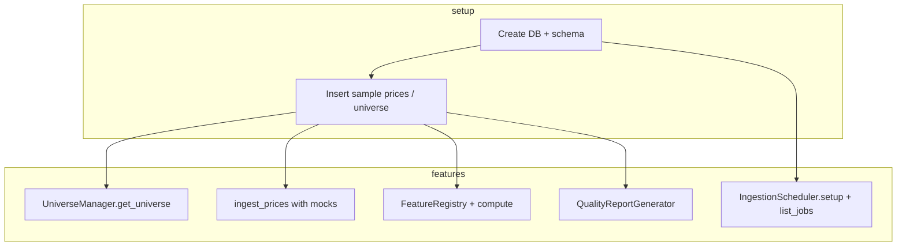

# Feature Verification and Regression Test Plan

> **Status: COMPLETED** (2025-01-22)
>
> All planned tests have been implemented. See Section 8 for implementation summary.

## Scope

- **Verification:** Assert each of the six merged features behaves as specified.
- **Regression:** Prevent regressions via full pytest suite, a new smoke/integration test, and documented pass criteria.

---

## 1. Current Test Coverage Summary

| Feature | Existing Tests | Location | Status |
|--------|----------------|----------|--------|
| **Data Quality Framework** | Checks, report, generator, health score, alerts, Platform API | [tests/test_data/test_quality.py](tests/test_data/test_quality.py), [tests/test_api/test_platform.py](tests/test_api/test_platform.py) | ✅ Complete |
| **S&P 500 Universe Management** | Exclusion rules, point-in-time queries, membership, sector breakdown, lineage, fetch/update | [tests/test_data/test_universe.py](tests/test_data/test_universe.py) | ✅ Complete |
| **Scheduled Data Ingestion** | Scheduler, jobs, CLI, dependency chain, ingestion_log logging | [tests/test_agents/](tests/test_agents/) | ✅ Complete |
| **Database Integrity Constraints** | NOT NULL, CHECK, FK, indexes, migration, validation | [test_constraints](tests/test_data/test_constraints.py), [test_migration_script](tests/test_data/test_migration_script.py), [test_migration_validation](tests/test_data/test_migration_validation.py) | ✅ Complete |
| **Polygon.io Integration** | Source, bars, corporate actions, rate limit, retry, fallback | [test_polygon_source](tests/test_data/test_polygon_source.py), [test_ingestion_fallback](tests/test_data/test_ingestion_fallback.py) | ✅ Complete |
| **Feature Store Versioning** | Registry, versioning, activation, computation, reproducibility | [tests/test_data/test_features.py](tests/test_data/test_features.py) | ✅ Complete |

---

## 2. Per-Feature Verification and New Tests

### 2.1 Data Quality Framework

**Verify:**

- All checks run and produce correct `CheckResult` / `QualityIssue`.
- Report generation, health score, and storage/retrieval work.
- Alerts: critical-issue email and daily-summary email (mocked).
- Platform API: `run_quality_checks`, `get_quality_report`, `get_quality_history`, `get_data_health_score`.

**New tests to add:**

- **Alerts:** In `test_quality.py` (or new `test_data/test_quality_alerts.py`):
  - `QualityAlertManager.send_critical_alert`: mock `EmailNotifier.send_html_email`, assert call when issues present, no call when empty.
  - `QualityAlertManager.send_daily_summary`: mock notifier, assert call with report fields.
- **Integration:** `run_quality_check_with_alerts` with `send_alerts=False`, `store_report=True`: assert report returned, stored, and optional alert not sent (mock notifier).
- **Platform API:** In [test_platform](tests/test_api/test_platform.py):
  - `run_quality_checks` (mocked alerts): populated DB, run checks, assert keys `report_date`, `health_score`, `passed`, `total_issues`, etc.
  - `get_quality_report` / `get_quality_history` / `get_data_health_score`: against DB with stored reports, assert structure and values.

**Regression:** Existing `test_quality` tests remain as regression for checks and report.

---

### 2.2 S&P 500 Universe Management

**Verify:**

- Exclusion rules, point-in-time queries, membership/changes, sector breakdown, lineage logging, fetch/update, price exclusions.

**New tests:** None required; coverage is sufficient.

**Regression:** Keep running `test_universe` and Platform `get_universe` tests.

---

### 2.3 Scheduled Data Ingestion

**Verify:**

- `IngestionScheduler`: add_job, remove_job, list_jobs, start/stop, `setup_daily_ingestion` registers jobs.
- `IngestionJob` base: `_check_dependencies`, `_log_start` / `_log_success` / `_log_failure`, retry loop, failure notification (mocked).
- `PriceIngestionJob` / `FeatureComputationJob`: execute with mocked ingestion; assert stats and ingestion_log updates.
- CLI: `run_job_now("prices")` / `run_job_now("features")` with mocks; `list_scheduled_jobs` returns expected structure.

**New tests to add:**

- **New file:** `tests/test_agents/` (create `__init__.py` if missing):
  - `test_scheduler.py`: Scheduler init; `add_job` / `remove_job`; `list_jobs`; `setup_daily_ingestion` then assert job IDs `price_ingestion`, `feature_computation`; optionally start/stop (avoid long-running).
  - `test_jobs.py`:
    - `PriceIngestionJob`: patch `ingest_prices`, run `job.run()`, assert `records_inserted` in result and ingestion_log row with `status='success'`. Ensure `data_sources` has matching `source_id` for job (or create in fixture).
    - `FeatureComputationJob`: same pattern with `compute_features` mocked.
    - Dependency: mock ingestion_log so dependency job "failed"; assert job returns `status: failed` and does not call execute.
  - `test_cli.py` (or under `test_agents`): `run_job_now("prices")` / `("features")` with patched jobs; `list_scheduled_jobs` (patch scheduler).

**Regression:** These new tests become the regression suite for scheduled ingestion.

**Note:** Jobs log to `ingestion_log` with `source_id` = job_id. Schema requires `source_id` FK to `data_sources`. Fixtures must ensure `data_sources` rows exist for `price_ingestion` and `feature_computation` (or equivalent), or migration/job setup creates them.

---

### 2.4 Database Integrity Constraints

**Verify:**

- NOT NULL, CHECK, FK (where not skipped), indexes, migration script, validation with sample data.

**New tests:** None required.

**Regression:** Keep `test_constraints`, `test_migration_script`, `test_migration_validation`. Re-run migration tests against a copy of current schema to detect schema drift.

---

### 2.5 Polygon.io Integration

**Verify:**

- Polygon source, daily bars, corporate actions, rate limiting, retries, validation; ingestion fallback (Polygon → YFinance) and upserts.

**New tests:** None required.

**Regression:** `test_polygon_source`, `test_ingestion_fallback`.

---

### 2.6 Feature Store Versioning

**Verify:**

- Registry CRUD, versioning, activation, computation, reproducibility.

**New tests:** None required.

**Regression:** `test_features`.

---

## 3. Regression Test Suite

### 3.1 Full Pytest Suite

- **Command:** `pytest tests/ -v` (optionally `--cov=hrp --cov-report=term-missing` per [pyproject.toml](pyproject.toml)).
- **Pass criteria:** All tests pass. No skipped tests unless documented (e.g. DuckDB FK limitations).

### 3.2 Smoke / Integration Test

**New test:** `tests/test_integration/test_smoke.py` (or `tests/test_smoke.py`).

- **Goal:** Single run touching all six features to catch integration breakage.
- **Steps (high level):**
  1. **DB constraints:** Create DB via `create_tables`, insert valid sample prices/universe.
  2. **Universe:** `UniverseManager.get_universe_at_date` (or Platform `get_universe`) with test data.
  3. **Polygon + ingestion:** `ingest_prices` with mocked Polygon (and optional YFinance fallback); verify rows in `prices`.
  4. **Feature store:** Register a feature, compute (or mock compute), assert stored/resolvable.
  5. **Data quality:** Run `QualityReportGenerator.generate_report` (or `run_quality_checks` with alerts off), assert report and health score.
  6. **Scheduled ingestion:** `IngestionScheduler.setup_daily_ingestion()` then `list_jobs()`; optionally `run_job_now("prices")` with mocks.

- **Scope:** Use `test_db` / `temp_db` style fixtures; mock external APIs and email. Keep it fast (< ~30s).

### 3.3 CI Recommendation

- Run `pytest tests/ -v` on every PR and on main.
- Run smoke test as part of the same job (or a dedicated "integration" step).
- Document in README or `docs/` how to run "all tests" and "regression suite."

---

## 4. Test Execution Summary

| Action | Command |
|--------|---------|
| All tests | `pytest tests/ -v` |
| With coverage | `pytest tests/ -v --cov=hrp --cov-report=term-missing` |
| By area | `pytest tests/test_data/ -v`, `tests/test_api/ -v`, `tests/test_agents/ -v`, etc. |
| Smoke only | `pytest tests/test_integration/test_smoke.py -v` (once added) |

**Environment:** Use `HRP_DB_PATH` for DB path in tests; no real Polygon API key or email in CI. Mock external services.

---

## 5. Deliverables

1. **Test plan (this document):** Stored in `docs/` (e.g. `docs/plans/test-plan-features-regression.md`) for reference.
2. **New tests:**
   - Data quality: alerts and `run_quality_check_with_alerts`; Platform quality methods.
   - Scheduled ingestion: `test_agents/test_scheduler.py`, `test_jobs.py`, and CLI-related tests.
   - Smoke: `test_integration/test_smoke.py` (or equivalent).
3. **Fixtures:** Extend `conftest.py` as needed (e.g. `data_sources` for job IDs, quality report storage).
4. **README/CI:** Update with "run all tests" and "regression" instructions; add CI job(s) if not present.

---

## 6. Dependency Graph (Smoke / Regression)



---

## 7. Out of Scope

- Performance/load testing.
- End-to-end tests against live Polygon or email (keep mocked).
- Changes to production schema or application code beyond what's needed to make tests reliable (e.g. dependency injection for notifier/sources only if we decide to refactor).

---

## 8. Implementation Summary (Completed 2025-01-22)

### New Test Files Created

| File | Tests | Description |
|------|-------|-------------|
| `tests/test_agents/__init__.py` | — | Package initialization |
| `tests/test_agents/test_scheduler.py` | 17 | IngestionScheduler: init, add/remove jobs, list, start/stop, pause/resume, setup_daily_ingestion |
| `tests/test_agents/test_jobs.py` | 30 | PriceIngestionJob, FeatureComputationJob: execute, run, dependencies, retry, failure notifications, logging |
| `tests/test_agents/test_cli.py` | 18 | CLI functions: run_job_now, list_scheduled_jobs, get_job_status, clear_job_history |
| `tests/test_integration/__init__.py` | — | Package initialization |
| `tests/test_integration/test_smoke.py` | 5 | Comprehensive smoke test touching all 6 features, plus individual feature isolation tests |

### Existing Files Extended

| File | Tests Added | Description |
|------|-------------|-------------|
| `tests/test_data/test_quality.py` | 10 | QualityAlertManager: send_critical_alert, send_daily_summary, process_report; run_quality_check_with_alerts |
| `tests/test_api/test_platform.py` | 13 | Platform API quality methods: run_quality_checks, get_quality_report, get_quality_history, get_data_health_score |
| `tests/conftest.py` | 2 fixtures | test_db_with_sources, populated_db_with_sources for job tests |

### Bug Fixes During Implementation

| File | Fix |
|------|-----|
| `hrp/data/schema.py` | Added sequences for auto-increment PKs (ingestion_log_seq, lineage_seq, quality_reports_seq) |
| `hrp/agents/jobs.py` | Changed status from 'success' to 'completed' to match schema CHECK constraint |
| `hrp/agents/cli.py` | Fixed clear_job_history to count before delete (DuckDB rowcount unreliable) |
| `hrp/agents/scheduler.py` | Made list_jobs/get_job_info defensive with getattr for optional attributes |
| `hrp/data/quality/report.py` | Added _ensure_quality_tables() calls to get_historical_reports() and get_health_trend() |

### Test Results

```
Total new tests: 93
All passing: Yes (152 tests in new + related test modules)
```

### Running the Tests

```bash
# All new tests
pytest tests/test_agents/ tests/test_integration/ -v

# Quality alert tests
pytest tests/test_data/test_quality.py::TestQualityAlertManager tests/test_data/test_quality.py::TestRunQualityCheckWithAlerts -v

# Platform API quality tests
pytest tests/test_api/test_platform.py::TestPlatformAPIQualityMethods tests/test_api/test_platform.py::TestPlatformAPIQualityWithData -v

# Full regression suite
pytest tests/ -v
```
